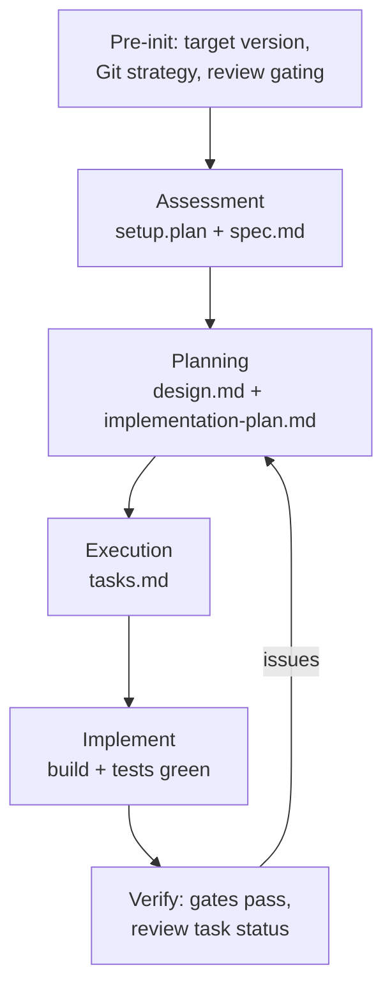
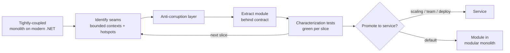
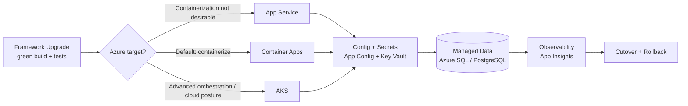
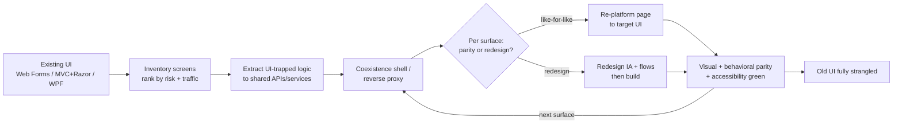

# Playbook: .NET Migration & Upgrade

> **Version**: 1.0 | **Last Updated**: 2026-06-24

## Overview

**What this project type involves**: Upgrading .NET applications to newer framework versions and optionally migrating them to Azure, delivered end-to-end. Scope spans in-version upgrades (e.g., .NET 6 → .NET 10 LTS) and platform migrations (.NET Framework → modern .NET), plus the associated technology modernization (EF6 → EF Core, legacy DI/logging/configuration → modern equivalents) and optional re-hosting to Azure. It may also include **UI modernization** — moving a presentation layer from an existing state (e.g., classic ASP.NET MVC/Web Forms, WPF/WinForms, server-rendered Razor) toward a desired target state (e.g., Blazor, a SPA such as React/Angular against a Web API, modern Razor Pages, or MAUI) — captured explicitly as current-state and target-state so the gap, not an assumption, drives scope. Beyond .NET-version concerns, an engagement sometimes targets the **application's design and architecture** — decomposing a tightly-coupled, hard-to-maintain monolith into a modern, modular architecture (clear bounded contexts, layered or modular-monolith structure, clean architecture, services, etc.) that is easier to extend, test, and operate. Architecture and UI modernization are explicitly-scoped, optional tracks sequenced alongside the upgrade, not assumed.

**Typical client profile**: Organizations running business-critical workloads on .NET Framework or out-of-support .NET (Core) versions. Triggers include end-of-support deadlines, security/compliance mandates, a cloud/Azure migration program, rising maintenance cost, or the desire to adopt LTS releases and modern libraries. Often a portfolio of solutions (web apps, APIs, desktop, services, test projects) with interdependencies and aging NuGet dependencies.

**What success looks like**: Every targeted project compiles and tests green on the target framework, breaking changes and deprecated APIs are resolved, NuGet packages are compatible and security-patched, behavior is preserved (or intentional changes are documented), and — where in scope — the workload runs on Azure. The upgrade is reproducible and auditable through the AIS spec artifacts (`spec.md`, `design.md`, `tasks.md`, and recorded evidence under `specs/YYMM-NNN-name/`), with a clean Git history and rollback path. The resulting code base passes any client-required security and code quality scans.

---

## Discovery Questions

Questions to ask during pre-sales and early discovery, organized by theme. Each notes which phase benefits most.

### Business

| # | Question | Phase |
|---|----------|-------|
| 1 | Why now? What's driving the upgrade? (EOL/EOS, security, compliance, Azure mandate, cost) | Pre-sales |
| 2 | What is the target framework and is LTS required? (e.g., .NET 10 LTS) | Pre-sales |
| 3 | Is Azure migration in scope, or framework upgrade only? | Pre-sales |
| 4 | Is application architecture modernization in scope (e.g., decomposing a monolith), or framework upgrade only? | Pre-sales |
| 5 | Is UI/UX modernization in scope, and is it a like-for-like re-platform or a redesign? | Pre-sales |
| 6 | What are the maintainability/extensibility pain points driving change? (slow releases, tight coupling, fragile tests, onboarding cost) | Pre-sales |
| 7 | What is the tolerance for behavioral change vs. strict parity? | Pre-sales |
| 8 | What is the deadline pressure? (hard EOS date vs. strategic initiative) | Pre-sales |

### Technical

| # | Question | Phase |
|---|----------|-------|
| 1 | What is the current framework per project? (.NET Framework 4.x, .NET 6/7/8, mixed?) | Pre-sales |
| 2 | How many projects/solutions, and what are the interdependencies? | Pre-sales / Setup |
| 3 | What app models are involved? (ASP.NET MVC/Web API, Razor Pages, WPF/WinForms, services, Blazor) | Pre-sales |
| 4 | What is the current architecture style and coupling? (layered monolith, big-ball-of-mud, modular, services; shared mutable state, static singletons, circular dependencies) | Pre-sales / Setup |
| 5 | What is the desired target architecture? (modular monolith, bounded contexts/DDD, vertical slices, microservices) and the appetite for it | Setup |
| 6 | Where are the seams/boundaries and which areas change most or hurt most? (module map, hotspots, change-coupling) | Setup |
| 7 | Are projects SDK-style or legacy `.csproj` format? | Setup |
| 8 | Which technologies need modernization? (EF6 → EF Core, System.Web, WCF, BinaryFormatter, AutoMapper/Newtonsoft, config/logging/DI) | Setup |
| 9 | Are there platform-specific dependencies (Windows-only APIs, COM, native interop)? | Setup |
| 10 | Is Central Package Management desired/already in use? | Setup |

### Data

| # | Question | Phase |
|---|----------|-------|
| 1 | Is EF6 in use, and is migration to EF Core required? | Pre-sales |
| 2 | Are there raw SQL, stored procedures, or ORM patterns that may break? | Setup |
| 3 | Do data-access behavioral changes (tracking, async, query translation) affect correctness? | Setup |

### Operations

| # | Question | Phase |
|---|----------|-------|
| 1 | What is the Git branching strategy for the upgrade, and the commit cadence? (per task / per group / at end) | Setup |
| 2 | Which AI coding agent will drive the upgrade (GitHub Copilot, Claude Code, Cursor, Codex, other), and what are its repo/tool permissions? | Setup |
| 3 | What review gating is required for upgrade changes (automatic vs human-in-the-loop)? | Setup |
| 4 | What test coverage exists to validate the upgrade? (unit, integration, UI, smoke) | Setup |
| 5 | What is the build/CI environment and target SDK availability? (target SDK installed on build agents) | Setup |
| 6 | What is the deployment target and rollback strategy after upgrade? | Design |

### UI / UX

> Only when UI modernization is in scope. Capture the **existing state** and the **desired target state** explicitly.

| # | Question | Phase |
|---|----------|-------|
| 1 | What is the current UI technology and state? (Web Forms, classic ASP.NET MVC + Razor, WPF/WinForms, Silverlight, jQuery/Bootstrap version, server-rendered vs. client-side) | Pre-sales |
| 2 | What is the desired target UI? (Blazor Server/WASM, SPA — React/Angular/Vue — on a Web API, modern Razor Pages, MAUI) and why | Pre-sales |
| 3 | Like-for-like re-platform (preserve screens/flows) or UX redesign (new IA, flows, visuals)? | Pre-sales |
| 4 | Is there a design system / component library to adopt or build? (e.g., Fluent UI, MUD Blazor, Tailwind, corporate design system) | Setup |
| 5 | What are the accessibility, browser/device, and responsive/mobile targets? (WCAG level, supported browsers, mobile/desktop) | Setup |
| 6 | How much business logic is embedded in the UI (code-behind, view logic) that must be extracted to APIs/services? | Setup |
| 7 | What is the screen/page inventory and which are highest-traffic or highest-risk? | Setup |
| 8 | Are localization/i18n, theming/branding, or print/report views in scope? | Setup |
| 9 | What UI/end-to-end test coverage exists, and what visual/interaction parity is required? | Design |

---

## Governing Questions Register

> These questions must be answered before their tagged phase begins.
> When using AIS spec commands with an active playbook, unanswered questions
> for the current phase will be surfaced as soft-gate blockers.

### Pre-sales Phase

| ID | Domain | Question | Drives |
|----|--------|----------|--------|
| GQ-001 | Business | What is the target framework and is LTS mandatory? | Upgrade target, longevity, scope of breaking changes |
| GQ-002 | Technical | What is the current framework per project and the portfolio size? | Scope, effort, version-vs-platform migration path |
| GQ-003 | Business | Is Azure migration in scope or framework upgrade only? | Whether re-hosting specs are included |
| GQ-004 | Technical | Are projects SDK-style or legacy project format? | Pre-upgrade conversion effort |
| GQ-005 | Business | Is application architecture modernization in scope, and what is the target architecture and appetite? | Whether re-architecture specs are included and how upgrade vs. re-architecture are sequenced |
| GQ-006 | Business | Is UI modernization in scope, what are the current and target UI states, and is it a re-platform or a redesign? | Whether UI specs are included, parity vs. redesign posture, and sequencing |

### Setup Phase

| ID | Domain | Question | Drives |
|----|--------|----------|--------|
| GQ-010 | Technical | What is the upgrade strategy — bottom-up, top-down, or all-at-once? | Sequencing of project upgrades |
| GQ-011 | Technical | In-place rewrite or side-by-side upgrade per project? | Risk posture and rollback granularity |
| GQ-012 | Technical | Which technologies will be modernized (EF, DI, logging, config)? | Refactoring scope inside the upgrade |
| GQ-013 | Operations | What Git commit cadence and review gating (per task / per group / at end)? | Review gates and human-in-the-loop control |
| GQ-014 | Operations | Is the target .NET SDK available on dev and CI build agents? | Execution-stage prerequisites |
| GQ-016 | Operations | Which AI coding agent drives the upgrade (Copilot, Claude Code, Cursor, Codex, other), and what repo/tool permissions does it have? | Tool-agnostic execution setup and human-review posture |
| GQ-017 | Technical | What target architecture and decomposition strategy will guide re-architecture (modular monolith, bounded contexts, services; strangler vs. big-bang)? | Re-architecture sequencing, seams, and spec decomposition |
| GQ-018 | Technical | What characterization/regression coverage must exist before refactoring the architecture? | Safety net that makes behavior-preserving decomposition viable |
| GQ-019 | Technical | What is the target UI stack and design system, and what migration strategy (page-by-page strangler vs. big-bang) applies? | UI spec decomposition, shared-shell needs, and sequencing |

### Design Phase

| ID | Domain | Question | Drives |
|----|--------|----------|--------|
| GQ-020 | Technical | How are unsupported APIs / incompatible packages handled per project? | Compatibility shims, replacements, or deferral |
| GQ-021 | Data | Does EF6 → EF Core migration change query/runtime behavior that affects correctness? | Data-access verification strategy |
| GQ-022 | Operations | What is the regression/validation baseline that defines "done"? | Test gates and acceptance evidence |
| GQ-023 | Technical | What visual/functional parity and accessibility (WCAG) bar defines UI "done", and how is it verified? | UI acceptance gates and test strategy (when UI in scope) |

---

## Typical Architecture Patterns

### Pattern: Three-Stage Upgrade Across the AIS Lifecycle

> **Driven by**: GQ-001 (target framework), GQ-010 (upgrade strategy), GQ-013 (commit cadence & review gating)

**When to use**: The default delivery rhythm for any spec-driven .NET upgrade. The domain's three classic stages — Assessment, Planning, Execution — do not replace the AIS lifecycle; they thread through it, starting in pre-sales/setup and completing per spec, with reviewable artifacts persisted under `specs/YYMM-NNN-name/` and confirmed at each gate.

**Components** (domain stage → where it lands in AIS):
- **Assessment** → begins in **Pre-Sales** (portfolio inventory, breaking-change/effort ROM from discovery) and **Setup** (`/ais.setup.plan` portfolio decomposition, `/ais.setup.architecture`), then sharpens per spec in `/ais.spec.specify` (breaking changes, API/package compatibility, and scope captured as requirements with QA/UAT readiness).
- **Planning** → `/ais.spec.design` (strategy decisions, EF data model, contracts, Verification Strategy) and, for larger/riskier upgrades, `implementation-plan.md`.
- **Execution** → `/ais.spec.tasks` (`tasks.md` with validation criteria) then `/ais.spec.implement` (build/test/evidence gates).

The decisions a generic upgrade workflow records in scratch `assessment` / `upgrade-options` / `scenario-instructions` notes live in AIS as `spec.md`, design decisions and ADRs under `specs/.architecture/`, and `specs/constitution.md` respectively.

**Agent-driven execution (tool-agnostic)**: Any AI coding agent — GitHub Copilot, Claude Code, Cursor, Codex, or similar — can drive the Execution loop. Point the agent at the active spec's artifacts as its source of truth: it reads `spec.md`/`design.md` for intent, works `tasks.md` in dependency order, runs deterministic .NET tooling (`dotnet build`/`test`, .NET Upgrade Assistant, `try-convert`) for mechanical steps, fixes compilation/test failures, records evidence, and commits per the agreed cadence (GQ-013). Because state lives in the spec files rather than a vendor-specific scratch folder, you can switch agents mid-engagement without losing continuity.

**Trade-offs**: Strong auditability and human review gates through the standard AIS artifacts; requires discipline to review and confirm each stage before proceeding. Re-ordering `tasks.md` in ways that break the project dependency graph can cause the upgrade to fail — re-run `/ais.spec.tasks` after material edits.

### Pattern: Bottom-Up (Leaf-First) Upgrade

> **Driven by**: GQ-010 (upgrade strategy), GQ-002 (interdependencies)

**When to use**: Solutions with clear project dependency graphs. Upgrade leaf/library projects first, then projects that depend on them, reducing compile churn.

**Components**: Dependency graph from assessment, per-project upgrade tasks ordered leaf → root, shared package alignment.

**Trade-offs**: Predictable, incremental, easier to isolate failures. Slower than all-at-once for small solutions.

### Pattern: All-at-Once (Atomic) Upgrade

**When to use**: Small, tightly-coupled solutions where a single atomic framework + package bump with consolidated compilation fixes is simplest (e.g., a small web app: target-framework bump, package updates, build-fix, test in one pass).

**Components**: Single atomic task to update target frameworks and packages, consolidated breaking-change fixes, full-suite test validation.

**Trade-offs**: Fast for small solutions; higher blast radius and harder to bisect failures on large portfolios.

### Pattern: Side-by-Side vs. In-Place Upgrade

**When to use**: Choose side-by-side (new project alongside legacy) when rollback granularity and parallel validation matter; in-place when the project is small and risk is low.

**Components**: New/modernized project files, multi-targeting where useful, retained legacy until validated.

**Trade-offs**: Side-by-Side eases rollback and comparison but adds temporary duplication; in-place is leaner but riskier.

### Pattern: Stabilize-then-Re-Architect (Sequencing)

> **Driven by**: GQ-005 (architecture modernization in scope), GQ-001 (target framework), GQ-018 (characterization coverage)

**When to use**: The application must run on modern .NET **and** the client wants to improve its design (e.g., break apart a tightly-coupled monolith). Sequence it: first get to the target framework with a green build and a behavioral baseline, then re-architect under that safety net. Re-architecting on an unsupported framework while also chasing parity multiplies risk and makes failures hard to attribute — the same separation-of-concerns logic as "Upgrade-then-Migrate to Azure". For .NET Framework apps where System.Web/WCF coupling is itself the blocker, a thin enabling decomposition may be needed *during* the platform migration; keep it minimal and explicitly scoped.

**Components**: Completed framework upgrade (build + tests green), characterization/regression tests as the safety net, a target architecture decision (modular monolith / bounded contexts / services) recorded as an ADR under `specs/.architecture/`, and incremental decomposition specs.

**Trade-offs**: Clear attribution — upgrade defects and design changes are isolated and independently verifiable; slightly longer overall timeline than a combined push, but materially lower risk.

### Pattern: Incremental Monolith Decomposition (Strangler Fig)

> **Driven by**: GQ-005 (architecture appetite), GQ-017 (decomposition strategy & seams), GQ-018 (characterization safety net)

**When to use**: A tightly-coupled, hard-to-maintain code base needs to become modular and extensible without a risky big-bang rewrite. Identify seams (bounded contexts, change-coupling hotspots), carve out modules behind interfaces one at a time, and route through an anti-corruption layer until each slice is migrated. Prefer a **modular monolith** as the default target — applying **Clean Architecture** for dependency management and **DDD** to guide module boundaries — since it captures most maintainability/extensibility gains with far less operational cost than microservices; promote modules to services only where scaling, deployment independence, or team boundaries justify it.

**Components**: Module/bounded-context map, anti-corruption layer, extracted modules with explicit contracts, dependency-inverted boundaries (DI, `Microsoft.Extensions.*`), characterization tests per slice, and per-module AIS specs decomposed in dependency order.

**Trade-offs**: Incremental, low-blast-radius, continuously shippable, and easy to pause; slower than a rewrite in raw calendar terms and requires discipline to avoid leaving a half-migrated structure. Big-bang rewrites are faster on paper but historically high-risk — reserve for small code bases only.

> Architecture modernization complements the **[Modernization](modernization.md)** playbook (Strangler Fig, Parallel Run, Re-Platform). Use this section for the .NET-upgrade-adjacent decomposition; reach for the modernization playbook when re-architecture is the primary objective rather than a track within a .NET upgrade.

### Pattern: Upgrade-then-Migrate to Azure

> **Driven by**: GQ-003 (Azure in scope), GQ-001 (target framework), GQ-014 (SDK on CI)

**When to use**: The workload must both run on a supported .NET version **and** move to Azure. Sequence the framework upgrade first (so the app is on modern .NET and green), then re-host/re-platform to the chosen Azure target. Running both at once multiplies risk and makes parity hard to attribute.

**Components**: Completed framework upgrade (build + tests green), target Azure service, IaC (Bicep/Terraform), CI/CD pipeline with target SDK, configuration/secrets migration (App Configuration + Key Vault), data/managed-database target, observability (Application Insights), cutover + rollback plan.

**Trade-offs**: Clear separation of concerns — upgrade issues and hosting issues are isolated and independently verifiable. Slightly longer overall timeline than a combined effort, but materially lower risk and easier rollback.

### Pattern: Azure Target Selection (App Service vs Container Apps vs AKS)

> **Driven by**: GQ-003 (Azure in scope), and the app model from discovery

**When to use**: Whenever Azure migration is in scope, to pick the landing service deliberately. Default to **Container Apps**; fall back to **App Service** when containerization isn't desirable; reserve **AKS** for advanced orchestration requirements or an existing Kubernetes/organizational cloud posture.

**Components**: App-model classification, containerization (the default path), networking/identity (Managed Identity), scaling model.

**Trade-offs**:

| Target | Best for | Pros | Cons |
|--------|----------|------|------|
| **Container Apps** (default) | Most upgraded .NET workloads — web/APIs, microservices, event-driven/scale-to-zero | Managed Kubernetes-free containers, KEDA scaling, Dapr, portability | Newer; some advanced K8s features absent |
| **App Service** (when containerization isn't desirable) | ASP.NET Core web apps/APIs with standard hosting needs and no container appetite | Fastest path, minimal infra, built-in scaling/slots | Less control; not ideal for heavy custom runtimes |
| **AKS** (advanced needs / cloud posture) | Complex multi-service systems needing full orchestration, or an existing Kubernetes standard | Maximum control, ecosystem, multi-tenant | Highest operational burden and cost |

> Desktop apps (WPF/WinForms) are not re-hosted to Azure compute; if cloud delivery is required, treat UI re-platforming (e.g., Blazor/web) as a separate, explicitly-scoped modernization track.

### Pattern: Incremental UI Re-Platform (UI Strangler)

> **Driven by**: GQ-006 (UI in scope, parity vs. redesign), GQ-019 (target UI stack + strategy), GQ-023 (parity/accessibility bar)

**When to use**: The presentation layer must move from an **existing state** (e.g., Web Forms, classic ASP.NET MVC + Razor views, server-rendered jQuery, WPF/WinForms) to a **desired target state** (e.g., Blazor Server/WASM, a SPA on a Web API, modern Razor Pages, MAUI) **and the source and target runtimes can coexist** — either both on ASP.NET Core, or split behind a reverse proxy (e.g., YARP) with shareable auth/session. Migrate **page/route-by-page**, running old and new UIs side-by-side until the surface is fully strangled. Sequence UI work **after** (or behind a safety net alongside) the framework upgrade — a UI on an unsupported framework is a moving target. Where business logic is trapped in code-behind/view logic, extract it to APIs/services first so both old and new UI can share it. Decide **parity vs. redesign** per surface up front: like-for-like re-platform preserves screens/flows; a redesign changes IA/visuals and needs explicit UX scope.

> **When coexistence isn't viable (forced cutover)**: Some platform jumps make incremental UI strangling impossible — `System.Web`-bound Web Forms and classic ASP.NET MVC views cannot run in-process with ASP.NET Core, so the views/controllers must be rewritten *as part of* the platform migration. A reverse-proxy split can still allow a route-by-route migration across two running apps, but only if shared auth/session/styling can be bridged at acceptable cost; when that overhead exceeds the value (small or tightly-shared UIs), a deliberate **big-bang UI cutover bundled with the framework migration** is the correct call. Treat it as one tracked effort: lock parity with characterization and UI/end-to-end tests, and rehearse a tested cutover and rollback.

**Components**: Current-state screen/page inventory with risk + traffic ranking, target-state decision per surface (parity vs. redesign), a coexistence shell/reverse proxy for side-by-side run, a design system/component library (adopt or build), extracted shared APIs for UI-trapped logic, per-page/per-feature AIS migration specs, and visual + behavioral parity and accessibility (WCAG) verification.

**Trade-offs**: Incremental, continuously shippable, low blast radius, and easy to pause; lets users migrate gradually — *when the runtimes can coexist*. Costs: a coexistence period with two UI stacks (shared auth/session/styling), risk of inconsistent UX during transition, and discipline needed to finish rather than stall half-migrated. Where coexistence is infeasible or its plumbing costs more than it saves, a bundled big-bang cutover (see the forced-cutover note above) is the pragmatic choice — accept the larger no-ship window and offset the risk with thorough parity testing and a rehearsed rollback.

**Common UI migration paths**:

| Existing state | Typical target state | Notes |
|----------------|---------------------|-------|
| ASP.NET Web Forms | Blazor, or Razor Pages / SPA + Web API | No direct upgrade path; treat as a re-platform, reuse business logic only |
| Classic ASP.NET MVC + Razor views | ASP.NET Core MVC/Razor Pages, Blazor, or SPA + API | `System.Web`-bound; can't run in-process with ASP.NET Core. Migrate route-by-route only via a reverse-proxy split, else cut over with the platform migration |
| Server-rendered + jQuery | Blazor or SPA (React/Angular/Vue) on a Web API | Decide whether to keep server-rendering or move to client-side |
| WPF / WinForms (desktop) | Web (Blazor/SPA) or MAUI (cross-platform desktop/mobile) | Web target enables cloud delivery; MAUI keeps a native client |

> When UI modernization is the primary objective (not a track within a .NET upgrade), reach for the **[Custom Applications](custom-applications.md)** and **[Modernization](modernization.md)** playbooks for deeper UX/redesign and re-platform guidance.

---

## Common Spec Decomposition

Typical specs for this engagement type. Use as a starting point for proposed specs.

| Area | Spec Scope | Effort Range | Frequency |
|------|-----------|--------------|-----------|
| Migration Tooling & Baseline Setup | Select/configure the AI coding agent (Copilot/Claude Code/Cursor/Codex) and its permissions; install target SDK on dev + CI; set up .NET Upgrade Assistant/`try-convert` as needed; validate prerequisites and capture a build/test baseline | S | Always |
| Portfolio Assessment | Run assessment per solution; review breaking changes, package/API compatibility, scope | S-M | Always |
| Upgrade Options & Strategy | Confirm strategy (bottom-up/top-down/all-at-once), in-place vs side-by-side, CPM, tech modernization | S | Always |
| SDK-Style Project Conversion | Convert legacy `.csproj` to SDK-style as a precursor | S-M | Often (Framework migrations) |
| Framework Upgrade (per solution/domain) | Execute target-framework + package upgrade and compilation fixes | M-L | Always |
| Technology Modernization | EF6 → EF Core, System.Web/WCF replacement, DI/logging/config modernization, BinaryFormatter removal | M-L | Often |
| Architecture Assessment & Target Design | Map current architecture/coupling and hotspots; define target architecture (modular monolith/bounded contexts/services) and decomposition strategy; record ADRs | S-M | When re-architecture in scope |
| Characterization Test Harness | Add characterization/regression tests around seams to make behavior-preserving refactoring safe | M | When re-architecture in scope |
| Architecture Decomposition (per module/context) | Extract a module/bounded context behind contracts via strangler approach; dependency-invert boundaries | M-L | When re-architecture in scope |
| UI Assessment & Target Design | Inventory current UI/screens; rank by risk/traffic; decide target stack and parity-vs-redesign per surface; define migration strategy and accessibility/responsive targets | S-M | When UI modernization in scope |
| Design System / Component Library | Adopt or build a component library, theming, and shared layout/shell for the target UI | S-M | When UI modernization in scope |
| UI Coexistence Shell | Reverse proxy / shell enabling old + new UI to run side-by-side with shared auth/session/styling | S-M | When UI modernization in scope |
| UI-Trapped Logic Extraction | Move business logic out of code-behind/view logic into shared APIs/services consumable by old and new UI | M | When UI modernization in scope |
| UI Migration (per page/feature) | Re-platform or redesign a screen/route to the target UI with visual + behavioral parity | M-L | When UI modernization in scope |
| UI Test & Accessibility Validation | UI/end-to-end tests, visual-regression checks, accessibility (WCAG) and cross-browser/responsive validation | M | When UI modernization in scope |
| Dependency / NuGet Remediation | Update incompatible/vulnerable packages; adopt Central Package Management | S-M | Always |
| Test Migration & Validation | Migrate test projects, run full suite, fix regressions, establish parity evidence | M | Always |
| Azure Landing Zone & IaC | Resource groups, networking, identity (Managed Identity), Bicep/Terraform, environments | M | Sometimes (Azure scope) |
| Azure Re-Host (compute) | Deploy upgraded workload to App Service / Container Apps / AKS; containerize if needed | M-L | Sometimes (Azure scope) |
| Config & Secrets Migration | Move config to App Configuration; secrets to Key Vault; remove web.config/app.config reliance | S-M | Sometimes (Azure scope) |
| Data Platform Migration | Move DB to Azure SQL / Azure Database for PostgreSQL; connection/identity changes | M-L | Sometimes (Azure scope) |
| Observability on Azure | Application Insights, log/metric dashboards, alerts | S-M | Sometimes (Azure scope) |
| Cutover & Rollback | Branch/merge strategy, deployment, rollback procedure, monitoring | S-M | Often |

---

## Estimation Patterns

> Playbooks own project-type-specific sizing guidance. Framework-wide proposal,
> SOW, green-sheet, external commercial-review, and commitment rules live in the
> pre-sales prompts and docs.

### Engagement Shape

| Shape | When to Use | Typical Team | Delivery Rhythm | Notes |
|-------|-------------|--------------|-----------------|-------|
| Single-solution upgrade sprint | One solution, in-version or small portfolio | 1-2 .NET engineers + reviewer | 1-3 week sprint | Spec-driven; engineer reviews each stage gate |
| Portfolio upgrade waves | Many solutions / repos | 2-4 .NET engineers + tech lead | Wave per solution group | Sequence by dependency and business criticality |
| Framework→modern + Azure | .NET Framework migration plus re-host | 2-4 engineers + cloud engineer | Milestone per domain + cutover | Add Azure migration and infra specs |
| Upgrade + re-architecture | Upgrade plus monolith decomposition / target-architecture shift | 2-5 engineers + architect/tech lead | Milestone per module/bounded context | Stabilize on modern .NET first, then strangle incrementally; add architecture and characterization-test specs |
| Upgrade + UI modernization | Upgrade plus presentation-layer re-platform/redesign | 2-5 engineers (incl. front-end) + UX designer + reviewer | Milestone per UI surface/page group | Stabilize on modern .NET first; migrate UI page-by-page behind a coexistence shell; add design-system and UI test specs |

### Effort Drivers

- **Version gap and platform jump** — .NET Framework → modern .NET is far heavier than in-version (e.g., 6 → 10) due to System.Web/WCF/WinForms/WPF API removals.
- **Breaking-change density** — count of deprecated/removed APIs surfaced in the assessment (e.g., BinaryFormatter removal, WPF control API incompatibilities).
- **Technology modernization scope** — EF6 → EF Core and config/DI/logging rewrites add significant effort.
- **Architecture modernization scope** — decomposing a tightly-coupled monolith (seam discovery, anti-corruption layers, per-module extraction, added test coverage) is often the single largest effort driver and is sized as its own track, separate from the version upgrade.
- **UI modernization scope** — re-platforming/redesigning the presentation layer is sized as its own track, driven by screen/page count, custom-control complexity, amount of client-side and code-behind logic, parity-vs-redesign posture, design-system build vs. adopt, and accessibility/responsive/cross-browser requirements.
- **Coupling and code health** — shared mutable state, static singletons, circular dependencies, and low cohesion raise both upgrade and re-architecture cost.
- **NuGet incompatibility & security fixes** — packages with no modern equivalent require replacement.
- **Project format** — legacy `.csproj` → SDK-style conversion adds a precursor step.
- **Test coverage** — low coverage increases manual validation effort and parity risk.
- **Portfolio size & interdependencies** — more projects and tighter coupling increase sequencing and integration cost.

### ROM Ranges by Complexity

| Complexity | Typical Range | Key Indicators |
|-----------|--------------|----------------|
| Simple | 40-120 hours | 1-3 SDK-style projects, in-version upgrade (e.g., 8 → 10), few package bumps, good tests |
| Moderate | 120-400 hours | 5-15 projects, some legacy format, EF or moderate API changes, partial Azure re-host |
| Complex | 400-1200+ hours | .NET Framework → modern, many projects, WCF/System.Web/desktop API removals, EF6 → EF Core, monolith decomposition / re-architecture, UI re-platform/redesign, Azure migration, strict parity |

### Common Multipliers

- **.NET Framework → modern .NET** — 1.5-2.5x vs. an equivalent in-version upgrade.
- **Low/absent test coverage** — 1.3-1.5x for manual validation and parity assurance.
- **Strict behavioral parity** — 1.2-1.4x for verification and documenting intentional changes.
- **Azure migration in scope** — 1.3-1.6x for re-host/re-platform and infra.
- **Architecture re-design in scope** — size as a separate track (typically a 1.5-3x+ band on the affected code, or independent M-L specs per module); driven by coupling, number of bounded contexts, and required new test coverage.
- **UI modernization in scope** — size as a separate track (typically independent M-L specs per page/feature, or a 1.5-3x+ band on the affected UI surface); a full UX redesign sits at the high end, a like-for-like re-platform lower. Add overhead for a coexistence shell and for building (vs. adopting) a design system.
- **Legacy project format conversion** — 1.1-1.3x precursor effort.

### Azure Migration Estimation (when Azure is in scope)

> Estimate Azure migration as **incremental effort on top of** the framework upgrade, not a replacement for it. Size each Azure spec separately; the upgrade must be green before re-host begins (see "Upgrade-then-Migrate to Azure").

#### Incremental ROM by Azure Target

| Azure Target | Incremental Range (per app) | Key Indicators |
|--------------|-----------------------------|----------------|
| App Service | 40-100 hours | Stateless ASP.NET Core web/API, standard config, single region |
| Container Apps | 80-200 hours | Needs containerization, KEDA/Dapr, event-driven or scale-to-zero |
| AKS | 200-500+ hours | Multi-service orchestration, networking/ingress, cluster ops, multi-tenant |

#### Azure Effort Drivers

- **Containerization** — apps not already containerized add Dockerfile/build/registry work (Container Apps, AKS).
- **Stateful vs stateless** — session/in-memory state, file-system reliance, or sticky-session needs add re-architecture.
- **Data platform move** — migrating to Azure SQL / Azure Database for PostgreSQL adds schema/connection/identity and cutover work; size with the data spec.
- **Networking & identity** — VNet integration, private endpoints, Managed Identity, and Key Vault wiring add infra effort.
- **Config & secrets** — moving off `web.config`/`app.config` to App Configuration + Key Vault.
- **Environments & IaC** — each environment (dev/test/prod) and Bicep/Terraform authoring adds setup cost.
- **Observability** — Application Insights instrumentation, dashboards, and alerts.
- **Cutover rigor** — zero-downtime, blue/green or slot-based deployment, and tested rollback.

#### Azure Multipliers

- **Containerization required** — 1.2-1.4x on the re-host spec.
- **Stateful workload re-architecture** — 1.3-1.6x for state externalization.
- **Data platform migration in scope** — 1.3-1.5x (or size as its own M-L spec).
- **Multi-region / HA / DR** — 1.4-1.8x for redundancy and failover.
- **Private networking / strict security baseline** — 1.2-1.4x for VNet, private endpoints, policy compliance.
- **Per additional environment** — +0.15-0.25x for each environment beyond the first.

### Staffing and Green-Sheet Guidance

| Role / Discipline | When Needed | Typical Allocation | Sizing Driver |
|-------------------|-------------|--------------------|---------------|
| .NET Upgrade Engineer | All phases | 100% | Portfolio size, breaking-change density |
| Tech Lead / Reviewer | Stage gates, design | 20-50% | Number of solutions, parity rigor |
| Data/EF Engineer | EF6 → EF Core work | 20-50% | EF migration scope |
| Cloud Engineer | Azure migration in scope | 50-100% | Re-host/re-platform complexity |
| QA / Test Engineer | Validation phase | 20-50% | Test coverage gap, parity requirements |

### Role Library

| Role | Typical Responsibilities | Often Needed When | AI/Coding-Agent Assumption |
|------|--------------------------|-------------------|----------------------------|
| .NET Upgrade Engineer | Drive the framework upgrade via the chosen AI coding agent, review stage gates, fix compilation/test failures | Always | Tool-agnostic agent (Copilot/Claude Code/Cursor/Codex) where client permits |
| Tech Lead | Confirm strategy, review assessment/plan, own quality gates | Multi-solution portfolios | Client permits, with human review gates |
| Data/EF Engineer | EF6 → EF Core migration, query/behavior validation | EF in scope | Client permits / TBD |
| Cloud Engineer | Azure target setup, deployment, rollback | Azure migration in scope | Client permits |
| QA Engineer | Regression suite, parity evidence, smoke tests | Low coverage or strict parity | Client permits |
| Front-End Engineer | Build the target UI (Blazor/SPA), component library, per-screen migration | UI modernization in scope | Tool-agnostic agent where client permits |
| UX/UI Designer | Target-state design, design system, redesign IA/flows, accessibility review | UI modernization with redesign | Client permits |

### Non-Labor Cost Drivers

- Azure/platform consumption — only when Azure migration is in scope; driven by target service (App Service/Container Apps/AKS) and environment count.
- Language-model/token usage — when an AI coding agent (Copilot, Claude Code, Cursor, Codex, or similar) drives the upgrade; usage scales with portfolio size and the number of assessment/plan/execution iterations.
- Third-party services — replacement NuGet/commercial libraries for components with no modern equivalent.
- UI component libraries / design tooling — commercial component suites (e.g., Telerik, DevExpress), design-system tooling, or font/icon licenses when UI modernization is in scope.
- Customer operating cost model — include when the upgrade changes hosting (on-prem → Azure) materially.

---

## Risk Patterns

| # | Risk | Likelihood | Impact | Mitigation |
|---|------|-----------|--------|------------|
| 1 | Removed/changed APIs (BinaryFormatter, System.Web, WCF, WPF control APIs) break compilation or runtime | High | High | Use the assessment's breaking-change catalog; plan replacements explicitly; validate at execution stage |
| 2 | NuGet packages have no compatible/modern version | Medium | High | Identify in assessment; select replacements early; isolate behind interfaces; flag security-vulnerable packages |
| 3 | EF6 → EF Core behavioral differences cause silent data/query bugs | Medium | High | Targeted data-access tests; review query translation and change-tracking semantics; compare results against baseline |
| 4 | Re-ordering `tasks.md` breaks the project dependency graph | Medium | High | Preserve leaf→root project order; don't drop prerequisite projects; re-run `/ais.spec.tasks` after material edits |
| 5 | Low test coverage hides regressions | Medium | High | Establish smoke/regression tests before execution; add characterization tests for critical paths |
| 6 | Legacy (non-SDK-style) projects complicate upgrade | Medium | Medium | Convert to SDK-style as a precursor spec before framework bump |
| 7 | Target SDK missing on CI/build agents | Medium | Medium | Verify SDK availability as a prerequisite task before the framework bump |
| 8 | Scope creep — adding features during the upgrade | High | Medium | Parity-first; new features become separate specs after the upgrade is green |
| 9 | Long-lived upgrade branch drifts from main | Medium | Medium | Choose appropriate Git commit cadence (per task/group); rebase/merge frequently |
| 10 | Big-bang re-architecture/rewrite stalls or never lands | Medium | High | Prefer incremental strangler decomposition; ship each module behind contracts; keep the app releasable throughout |
| 11 | Refactoring architecture without a behavioral safety net introduces silent regressions | Medium | High | Add characterization/regression tests around seams before extraction (GQ-018); validate each slice against baseline |
| 12 | Mixing the framework upgrade and re-architecture in one pass obscures defect attribution | Medium | High | Stabilize on modern .NET first, then re-architect (Stabilize-then-Re-Architect); keep any enabling decomposition during migration minimal |
| 13 | Over-decomposition into microservices adds operational cost without benefit | Medium | Medium | Default to a modular monolith; promote to services only where scaling/team/deploy boundaries justify it |
| 14 | UI parity/visual regressions slip through during re-platform | Medium | High | Capture current-state screen inventory; add visual + behavioral parity checks per surface; verify against baseline (GQ-023) |
| 15 | Choosing a big-bang UI cutover by default when incremental coexistence was viable | Medium | High | Use page/route-by-route migration behind a coexistence shell where runtimes allow it; reserve big-bang for cases where the platform jump forces it (e.g., `System.Web`-coupled UI → ASP.NET Core), and de-risk those with characterization/parity tests and a tested cutover/rollback |
| 16 | Accessibility (WCAG) or responsive/cross-browser requirements regress in the new UI | Medium | Medium | Set explicit accessibility/responsive targets early; gate per surface with automated + manual checks |
| 17 | Business logic trapped in UI code-behind blocks reuse and clean migration | Medium | Medium | Extract UI-trapped logic to shared APIs/services first so old and new UI consume the same behavior |
| 18 | SPA/API contract coupling causes churn as UI and backend evolve together | Medium | Medium | Define stable API contracts before/while building the SPA; version and test the contract |

---

## Tech Stack Recommendations

| Layer | Default | Alternatives | Notes |
|-------|---------|-------------|-------|
| Modernization driver | AI coding agent (tool-agnostic) | GitHub Copilot, Claude Code, Cursor, Codex, or manual engineering | Drives assessment/plan/execution through AIS spec artifacts; pick per client permissions |
| Mechanical upgrade tooling | .NET Upgrade Assistant / `try-convert` / `dotnet` CLI | AI Agent-drive upgrades and manual edits | Deterministic transforms (SDK-style conversion, framework retarget, restore/build) the agent or engineer invokes |
| Target framework | Latest .NET LTS | Latest STS | Prefer LTS for longevity unless a specific STS feature is required |
| ORM | EF Core (from EF6) | Dapper, raw ADO.NET | Migrate EF6 when modernizing data access; validate behavior |
| Project format | SDK-style `.csproj` | — | Convert legacy projects first |
| Target architecture | Modular monolith with Clean Architecture, DDD-guided boundaries | Bounded contexts as separate services, vertical slices, microservices | Default to a modular monolith using Clean Architecture for dependency management and DDD to guide boundaries; decompose to services only where scaling/team/deploy boundaries justify it |
| Decomposition approach | Strangler Fig (incremental) | Big-bang rewrite (small code bases only) | Extract modules behind contracts with an anti-corruption layer; keep the app releasable |
| UI target (if in scope) | Decide per engagement — no default | Blazor (Server/WASM), SPA (React/Angular/Vue) + Web API, modern Razor Pages, MAUI (desktop) | Too many variables to default; choose from the current-state UI, team skills, interactivity/offline needs, and whether desktop/native is required |
| UI migration approach | Incremental UI strangler (page/route-by-route) | Big-bang UI rewrite (small UIs only) | Run old + new UI side-by-side behind a coexistence shell/reverse proxy until strangled |
| Design system (if UI in scope) | Adopt existing (Fluent UI, MUD Blazor, corporate system) | Build bespoke | Prefer adopting a mature library; build only when branding/UX demands it |
| Package governance | Central Package Management | Per-project versions | Adopt CPM for multi-project consistency |
| Configuration | `Microsoft.Extensions.Configuration` | Legacy `web.config`/`app.config` | Modernize during platform migration |
| DI / Logging | `Microsoft.Extensions.DependencyInjection` / `ILogger` | Third-party containers | Replace legacy DI/logging during modernization |
| Serialization | `System.Text.Json` | `Newtonsoft.Json` | Prefer STJ; replace removed `BinaryFormatter` usage |
| Azure host (if in scope) | Azure Container Apps | App Service (when containerization isn't desirable), AKS (advanced hosting needs or org cloud posture) | Default to Container Apps; fall back to App Service if containerization isn't wanted; reserve AKS for advanced orchestration requirements or an existing Kubernetes/organizational cloud posture |
| CI/CD | GitHub Actions | Azure DevOps | Ensure target SDK on build agents |

---

## Quality Gates

| Gate | Category | Criteria | Severity |
|------|----------|----------|----------|
| Clean Build | Functional | Solution builds with 0 errors on the target framework | MUST |
| Tests Green | Testing | Full test suite passes with 0 failures post-upgrade | MUST |
| Breaking Changes Resolved | Functional | Every API/breaking change in the assessment is addressed or explicitly deferred | MUST |
| Package Compatibility | Security | All NuGet packages compatible; known vulnerabilities patched | MUST |
| Behavioral Parity | Functional | Behavior preserved, or intentional changes documented | MUST |
| Stage Artifacts Reviewed | Process | spec.md, design.md (and implementation-plan.md when present) reviewed and confirmed before implementation | MUST |
| Target Framework Applied | Functional | All targeted projects target the agreed framework | MUST |
| EF Behavior Validated | Data | EF Core data-access behavior validated against baseline (when EF in scope) | SHOULD |
| Clean Git History | Process | Commits follow the agreed cadence with clear messages and rollback points | SHOULD |
| Target Architecture Honored | Architecture | Extracted modules respect the agreed boundaries/contracts with no new cyclic or cross-context coupling (when re-architecture in scope) | SHOULD |
| Decomposition Safety Net | Testing | Characterization/regression coverage exists around each seam before extraction and stays green after (when re-architecture in scope) | SHOULD |
| UI Parity & Visual Regression | Functional | Each migrated screen matches agreed visual + behavioral parity, or intentional redesign is documented (when UI in scope) | SHOULD |
| Accessibility | Functional | Migrated UI meets the agreed WCAG level via automated + manual checks (when UI in scope) | SHOULD |
| Responsive & Cross-Browser | Functional | Migrated UI works across the agreed browsers/devices and responsive breakpoints (when UI in scope) | SHOULD |

---

## Deliverable Checklist

### Pre-Sales Phase

- [ ] Portfolio inventory (projects, frameworks, app models, interdependencies)
- [ ] Current architecture/coupling snapshot and maintainability pain points captured
- [ ] Current UI state inventory (app models, screens, UI tech) and UI-modernization-in-scope decision with target direction (when UI in scope)
- [ ] Upgrade target and LTS decision; Azure-in-scope decision; architecture-modernization-in-scope decision
- [ ] High-level breaking-change and effort ROM by complexity (upgrade and, if in scope, re-architecture and UI sized separately)

### Kickoff Phase

- [ ] Target SDK available on dev + CI; AI coding agent (Copilot/Claude Code/Cursor/Codex) selected with permissions agreed; upgrade tooling (.NET Upgrade Assistant/`try-convert`) ready and a build/test baseline captured
- [ ] Confirmed strategy: bottom-up/top-down/all-at-once, in-place vs side-by-side, CPM, modernization scope
- [ ] Target architecture and decomposition strategy agreed and recorded as ADRs (when re-architecture in scope)
- [ ] Target UI stack, migration strategy, design system, and accessibility/responsive targets agreed (when UI in scope)
- [ ] Git branching strategy, commit cadence, and review gating agreed
- [ ] Portfolio assessment completed and reviewed per solution (captured via `/ais.setup.plan` + each `spec.md`)

### Per-Spec Phase

- [ ] Upgrade strategy confirmed for the solution/domain in `design.md` (and ADRs under `specs/.architecture/` where relevant)
- [ ] `design.md` / `implementation-plan.md` reviewed; spec-level preferences reflected in `specs/constitution.md`
- [ ] `tasks.md` executed via `/ais.spec.implement`: build green, tests green, breaking changes resolved
- [ ] Parity evidence captured (or documented intentional changes)
- [ ] UI parity (visual + behavioral), accessibility, and responsive/cross-browser evidence captured per migrated surface (when UI in scope)

### Closeout Phase

- [ ] All targeted projects on the target framework with passing tests
- [ ] Target architecture realized for in-scope modules (boundaries/contracts honored) with the app releasable throughout (when re-architecture in scope)
- [ ] UI fully migrated to the target stack with the old UI strangled, parity/accessibility evidence retained, and the coexistence shell retired (when UI in scope)
- [ ] Dependency/security remediation complete
- [ ] Azure deployment validated (if in scope) with rollback verified
- [ ] Upgrade artifacts retained under `specs/YYMM-NNN-name/` (spec, design, tasks, evidence)
- [ ] Post-upgrade recommendations (adopt new target-version features) captured

---

## Anti-Patterns

| Anti-Pattern | Why It's Bad | What to Do Instead |
|-------------|-------------|-------------------|
| Skipping assessment review and jumping to execution | Misses breaking changes and incompatible packages; execution fails or produces silent regressions | Review and confirm `spec.md` and `design.md` at each gate before `/ais.spec.implement` |
| Dropping prerequisite projects from `tasks.md` | Breaks the dependency-driven upgrade path; dependent projects fail to upgrade | Preserve dependency order; re-run `/ais.spec.tasks` after edits |
| Upgrading and adding features at the same time | Can't validate parity against a moving target; scope explodes | Parity-first; defer features to separate post-upgrade specs |
| Starting execution against low/no test coverage with no baseline | Regressions go undetected | Establish smoke/regression tests and a behavioral baseline before execution |
| Bumping target framework without verifying SDK on CI | Build agents fail; pipeline breaks | Verify target SDK in execution prerequisites before the framework bump |
| Treating .NET Framework → modern as a simple version bump | Underestimates System.Web/WCF/desktop API removals and EF migration | Plan platform migration as a heavier track with dedicated modernization specs |
| Bundling the framework upgrade and a re-architecture into one pass | Can't attribute defects; parity is unverifiable against a moving design | Stabilize on modern .NET first, then re-architect under a test safety net |
| Big-bang rewrite to "fix the architecture" | High-risk, long no-ship window, frequently stalls | Decompose incrementally with the strangler approach; keep the app releasable per slice |
| Refactoring boundaries without characterization tests | Silent behavioral regressions slip through | Add characterization/regression coverage around each seam before extraction |
| Jumping straight to microservices | Operational cost and distributed-system complexity without clear benefit | Default to a modular monolith; extract services only where scaling/team/deploy boundaries justify it |
| Defaulting to a big-bang UI rewrite when incremental coexistence is viable | Long no-ship window and parity gaps when you *could* have shipped gradually | When the runtimes can coexist (e.g., both ASP.NET Core, or a reverse-proxy split with shareable auth/session), migrate page/route-by-route and keep both UIs shippable. A big-bang cutover is legitimate when the platform jump forces it (see below) — just don't choose it by default |
| Forcing the framework upgrade and UI re-platform into *separate* tracks when the UI is runtime-coupled | Wastes effort building throwaway coexistence plumbing; `System.Web`-bound Web Forms/classic MVC views can't run in-process with ASP.NET Core, so artificial separation is impossible or pure overhead | When the existing UI is inseparable from the platform (e.g., .NET Framework ASP.NET MVC → ASP.NET Core), treat the UI move *as* the platform migration: one tracked effort with strong characterization/parity testing and a deliberate cutover. Separate the tracks only when the runtimes genuinely allow side-by-side coexistence |
| Dropping accessibility/responsive requirements to "move faster" | Ships a UI that regresses on WCAG/devices and is costly to retrofit | Set accessibility/responsive targets up front and gate each surface against them |
| Pixel-parity obsession when a redesign was intended | Wastes effort matching a UI the client wants to change | Decide parity vs. redesign per surface up front; verify against the agreed target, not the old pixels |
| Ignoring the spec artifacts after upgrade | Loses auditability and rollback context | Retain `specs/YYMM-NNN-name/` artifacts as engagement deliverables |
