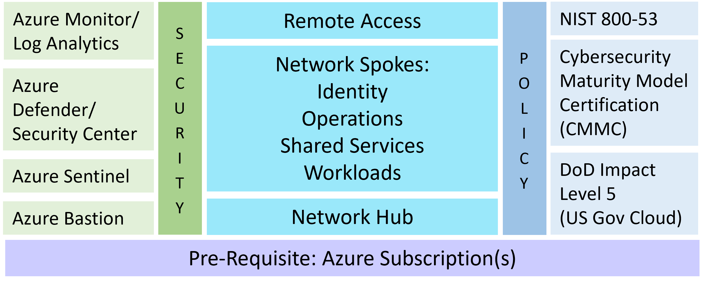
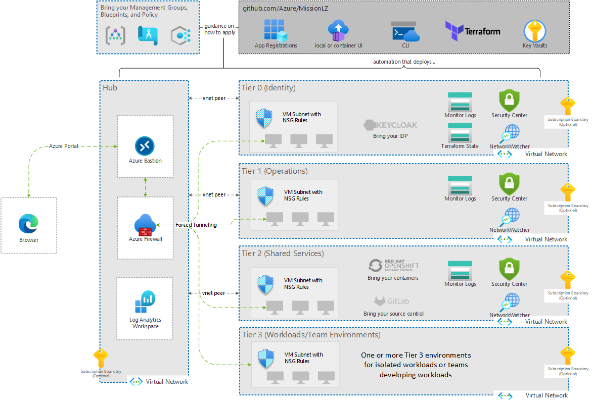

# Mission LZ

## What is Mission Landing Zone?

Mission Landing Zone is a highly opinionated Infrastructure-as-Code (IaC) template which IT oversight organizations can use to create a cloud management system to deploy Azure environments for their teams.

It addresses a narrowly scoped, specific need for an SCCA compliant hub and spoke infrastructure.

Mission Landing Zone is:

- Designed for US Gov mission customers
- Implements [SCCA](https://docs.microsoft.com/en-us/azure/azure-government/compliance/secure-azure-computing-architecture) requirements following Microsoft's [SACA](https://aka.ms/saca) implementation guidance
- Deployable in commercial, government, and air-gapped Azure clouds
- A narrow scope for a specific common need
- A simple solution with low configuration
- Written as [Bicep](./src/bicep/README.md) and [Terraform](./src/terraform/README.md) templates

Mission Landing Zone is the right solution when:

- A simple, secure, and scalable hub and spoke infrastructure is needed
- Various teams need separate, secure cloud environments administered by a central IT team
- There is a need to implement SCCA
- Hosting any workload requiring a secure environment, for example: data warehousing, AI/ML, and containerized applications

Design goals include:

- A simple, minimal set of code that is easy to configure
- Good defaults that allow experimentation and testing in a single subscription
- Deployment via command line or with a user interface
- Uses Azure PaaS products

Our intent is to enable IT Admins to use this software to:

- Test and evaluate the landing zone using a single Azure subscription
- Develop a known good configuration that can be used for production with multiple Azure subscriptions
- Optionally, customize the Terraform deployment configuration to suit specific needs
- Deploy multiple customer workloads in production

## Quickstart

You can get up and running quickly by deploying Mission Landing Zone with the Azure Portal or executing some Azure CLI commands.

You must have [Owner RBAC permissions](https://docs.microsoft.com/en-us/azure/role-based-access-control/built-in-roles#owner) to the subscription(s) you deploy Mission Landing Zone into.

### Deploy from the Azure Portal

1. Deploy Mission Landing Zone into `AzureCloud` or `AzureUsGovernment` from the Azure Portal:

    <!-- markdownlint-disable MD013 -->
    <!-- allow for longer lines to acommodate button links -->
    | Azure Commercial | Azure Government |
    | :--- | :--- |
    | [](https://portal.azure.com/#blade/Microsoft_Azure_CreateUIDef/CustomDeploymentBlade/uri/https%3A%2F%2Fraw.githubusercontent.com%2FAzure%2Fmissionlz%2Fmain%2Fsrc%2Fbicep%2Fmlz.json/uiFormDefinitionUri/https%3A%2F%2Fraw.githubusercontent.com%2FAzure%2Fmissionlz%2Fmain%2Fsrc%2Fbicep%2Fform%2Fmlz.portal.json) | [](https://portal.azure.us/#blade/Microsoft_Azure_CreateUIDef/CustomDeploymentBlade/uri/https%3A%2F%2Fraw.githubusercontent.com%2FAzure%2Fmissionlz%2Fmain%2Fsrc%2Fbicep%2Fmlz.json/uiFormDefinitionUri/https%3A%2F%2Fraw.githubusercontent.com%2FAzure%2Fmissionlz%2Fmain%2Fsrc%2Fbicep%2Fform%2Fmlz.portal.json) |
    <!-- markdownlint-enable MD013 -->

1. After a successful deployment, see our [examples](./src/bicep/examples/README.md) directory for how to extend the capabilities of Mission Landing Zone.

    - Extend your Mission Landing Zone deployment with the templates at [src/bicep/examples](./src/bicep/examples/README.md)

### Deploy using Azure CLI

Or, you can deploy Mission Landing Zone using Azure CLI.

Don't have Azure CLI? Here's how to get started with Azure Cloud Shell in your browser: <https://docs.microsoft.com/en-us/azure/cloud-shell/overview>

1. Clone the repository:

    ```plaintext
    git clone https://github.com/Azure/missionlz.git
    ```

1. Deploy Mission Landing Zone with the `az deployment sub create` command:

    ```plaintext
    az deployment sub create \
      --name myMlzDeployment \
      --location eastus \
      --template-file ./missionlz/src/bicep/mlz.bicep
    ```

1. You'll be prompted for the one required argument `resourcePrefix` (a unique alphanumeric string without whitespaces and 3-10 characters in length), which is used to to generate names for your resource groups and resources:

    ```plaintext
    > Please provide string value for 'resourcePrefix' (? for help): (your unique alphanumeric string without whitespaces and 3-10 characters in length)
    ```

1. After a successful deployment, see our [examples](./src/bicep/examples/README.md) directory for how to extend the capabilities of Mission Landing Zone.

    - Extend your Mission Landing Zone deployment with the templates at [src/bicep/examples](./src/bicep/examples/README.md)

## Scope

Mission LZ has the following scope:

- Hub and spoke networking intended to comply with SCCA controls
- Remote access
- Shared services, i.e., services available to all workloads via the networking hub
- Ability to create multiple workloads or team subscriptions
- Compatibility with SCCA compliance (and other compliance frameworks)
- Security using standard Azure tools with sensible defaults

<!-- markdownlint-disable MD033 -->
<!-- allow html for images so that they can be sized -->

<!-- markdownlint-enable MD033 -->

## Networking

Networking is set up in a hub and spoke design, separated by tiers: T0 (Identity and Authorization), T1 (Infrastructure Operations), T2 (DevSecOps and Shared Services), and multiple T3s (Workloads). Security can be configured to allow separation of duties between all tiers. Most customers will deploy each tier to a separate Azure subscription, but multiple subscriptions are not required.

<!-- markdownlint-disable MD033 -->
<!-- allow html for images so that they can be sized -->

<!-- markdownlint-enable MD033 -->

## Firewall

All network traffic is directed through the firewall residing in the Network Hub resource group in this architecture. The firewall is configured as the default route for all the T0 (Identity and Authorization) through T3(n) (Team Environments) resource groups as follows:  

|Name         |Address prefix| Next hop type| Next hop IP address|
|-------------|--------------|-----------------|-----------------|
|default_route| 0.0.0.0/0    |Virtual Appliance|10.0.100.4       |

The default firewall configured for MLZ is [Azure Firewall Premium](https://docs.microsoft.com/en-us/azure/firewall/premium-features) for both Azure Commercial and Azure Government to allow for enhanced security posturing.  
Presently, there are two firewall rules configured to ensure access to the Azure Portal and to facilitate interactive logon via PowerShell and Azure CLI, all other traffic is restricted by default. Below are the collection of rules configured for Azure Commercial and Azure Government clouds:

|Rule Collection Priority | Rule Collection Name | Rule name | Source | Port     | Protocol                               |
|-------------------------|----------------------|-----------|--------|----------|----------------------------------------|
|100                      | AllowAzureCloud      | AzureCloud|*       |   *      |Any                                     |
|110                      | AzureAuth            | msftauth  |  *     | Https:443| aadcdn.msftauth.net, aadcdn.msauth.net |

## Getting Started using Mission LZ

See our [Getting Started Guide](docs/getting-started.md) in the docs.

## Product Roadmap

See the [Projects](https://github.com/Azure/missionlz/projects) page for the release timeline and feature areas.

Here's what the repo consists of as of May 2021:

<!-- markdownlint-disable MD033 -->
<!-- allow html for images so that they can be sized -->

<!-- markdownlint-enable MD033 -->

## Contributing

This project welcomes contributions and suggestions. See our [Contributing Guide](CONTRIBUTING.md) for details.

## Feedback, Support, and How to Contact Us

Please see the [Support and Feedback Guide](SUPPORT.md). To report a security issue please see our [security guidance](./SECURITY.md).

## Trademarks

This project may contain trademarks or logos for projects, products, or services. Authorized use of Microsoft
trademarks or logos is subject to and must follow
[Microsoft's Trademark & Brand Guidelines](https://www.microsoft.com/en-us/legal/intellectualproperty/trademarks/usage/general).
Use of Microsoft trademarks or logos in modified versions of this project must not cause confusion or imply Microsoft sponsorship.
Any use of third-party trademarks or logos are subject to those third-party's policies.

## Nightly Build Status

<!-- markdownlint-disable MD033 -->
|Deployment Type|Azure Cloud| Azure Government|
|-------------|--------------|-----------------|
|Bicep| [](https://ag-ascii.visualstudio.com/Mission%20Landing%20Zone%20-%20Pipeline/_build/latest?definitionId=164&branchName=main)|[](https://ag-ascii.visualstudio.com/Mission%20Landing%20Zone%20-%20Pipeline/_build/latest?definitionId=165&branchName=main)|
|Terraform| [](https://ag-ascii.visualstudio.com/Mission%20Landing%20Zone%20-%20Pipeline/_build/latest?definitionId=166&branchName=main) |[](https://ag-ascii.visualstudio.com/Mission%20Landing%20Zone%20-%20Pipeline/_build/latest?definitionId=167&branchName=main)
<!-- markdownlint-enable MD033 -->
