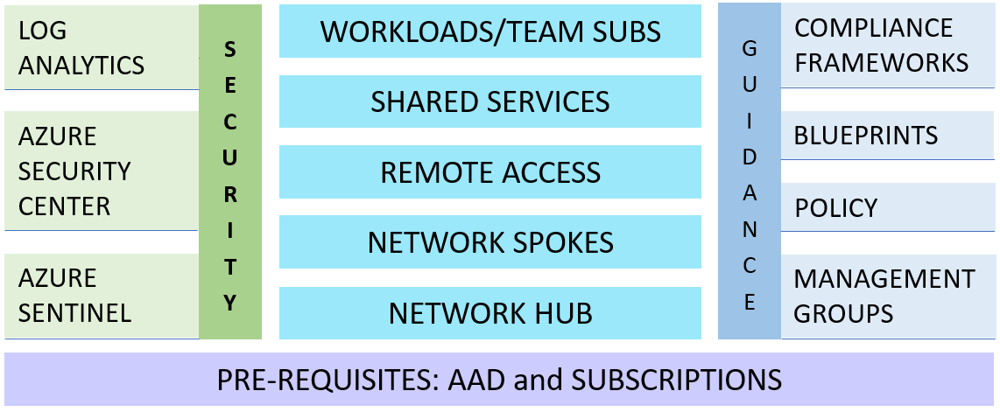

# Mission LZ

Mission Landing Zone is a highly opinionated template which IT oversight organizations can use to create a cloud management system to deploy Azure environments for their teams. It addresses a narrowly scoped, specific need for an SCCA compliant hub and spoke infrastructure.

Mission LZ is:

- Designed for US Gov mission customers​
- Implements [SCCA](https://docs.microsoft.com/en-us/azure/azure-government/compliance/secure-azure-computing-architecture) requirements following Microsoft's [SACA](https://aka.ms/saca) implementation guidance
- Deployable in commercial, government, and air-gapped Azure clouds
- A narrow scope for a specific common need​
- A simple solution with low configuration​
- Written in Terraform and Linux shell scripts

Mission Landing Zone is the right solution when:

- A simple, secure, and scalable hub and spoke infrastructure is needed
- Various teams need separate, secure cloud environments administered by a central IT team
- There is a need to implement SCCA
- Hosting any workload requiring a secure environment, for example: data warehousing, AI/ML, and containerized applications

Design goals include:

- A simple, minimal set of code that is easy to configure
- Good defaults that allow experimentation and testing in a single subscription
- Deployment via command line or with a user interface
- Uses Azure PaaS products

Our intent is to enable IT Admins to use this software to:

- Test and evaluate the landing zone using a single Azure subscription
- Develop a known good configuration that can be used for production with multiple Azure subscriptions
- Optionally, customize the Terraform deployment configuration to suit specific needs
- Deploy multiple customer workloads in production

## Scope

Mission LZ has the following scope:

- Hub and spoke networking intended to comply with SCCA controls
- Remote access
- Shared services, i.e., services available to all workloads via the networking hub
- Ability to create multiple workloads or team subscriptions
- Compatibility with SCCA compliance (and other compliance frameworks)
- Security using standard Azure tools with sensible defaults

<!-- markdownlint-disable MD033 -->
<!-- allow html for images so that they can be sized -->

<!-- markdownlint-enable MD033 -->

## Networking

Networking is set up in a hub and spoke design, separated by tiers: T0 (Identity and Authorization), T1 (Infrastructure Operations), T2 (DevSecOps and Shared Services), and multiple T3s (Workloads). Security can be configured to allow separation of duties between all tiers. Most customers will deploy each tier to a separate Azure subscription, but multiple subscriptions are not required.

<!-- markdownlint-disable MD033 -->

<!-- markdownlint-enable MD033 -->

## Getting Started using Mission LZ

See our [Getting Started Guide](src/docs/getting-started.md) in the docs.

## Product Roadmap

See the [Projects](https://github.com/Azure/missionlz/projects) page for the release timeline and feature areas.

Here's what the repo consists of as of April 2021:

<!-- markdownlint-disable MD033 -->

<!-- markdownlint-enable MD033 -->

## Contributing

This project welcomes contributions and suggestions. See our [Contributing Guide](CONTRIBUTING.md) for details.

## Feedback, Support, and How to Contact Us

Please see the [Support and Feedback Guide](SUPPORT.md). To report a security issue please see our [security guidance](./SECURITY.md).

## Trademarks

This project may contain trademarks or logos for projects, products, or services. Authorized use of Microsoft
trademarks or logos is subject to and must follow
[Microsoft's Trademark & Brand Guidelines](https://www.microsoft.com/en-us/legal/intellectualproperty/trademarks/usage/general).
Use of Microsoft trademarks or logos in modified versions of this project must not cause confusion or imply Microsoft sponsorship.
Any use of third-party trademarks or logos are subject to those third-party's policies.
