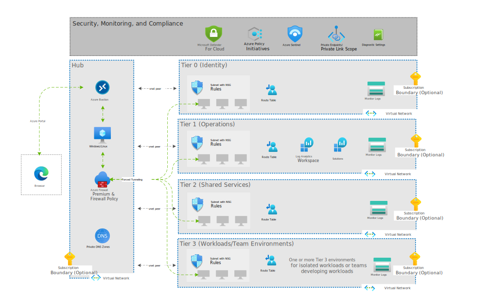

# Mission LZ

Mission Landing Zone is a highly opinionated Infrastructure-as-Code (IaC) template which IT oversight organizations can use to create a cloud management system to deploy Azure environments for their workloads and teams.

Mission Landing Zone addresses a narrowly scoped, specific need for a [Secure Cloud Computing Architecture (SCCA)](docs/scca.md) compliant hub and spoke infrastructure.

- Designed for US Government mission customers
- Implements SCCA controls following Microsoft's [SACA](https://aka.ms/saca) implementation guidance
- Deployable in Azure commercial, Azure Government, Azure Government Secret, and Azure Government Top Secret clouds
- A simple solution with low configuration and narrow scope
- Written as [Bicep](./src/bicep/) and [Terraform](./src/terraform/) templates

Mission Landing Zone is the right solution when:

- A simple, secure, and scalable hub and spoke infrastructure is needed.
- A central IT team is administering cloud resources on behalf of other teams and workloads.
- There is a need to implement SCCA.
- Hosting any workload requiring a secure environment, for example: data warehousing, AI/ML, and containerized applications.

Design goals include:

- A simple, minimal set of code that is easy to configure
- Good defaults that allow experimentation and testing in a single subscription
- Deployment via command line or with a user interface
- 100% Azure PaaS products

Our intent is to enable IT Admins to use this software to:

- Test and evaluate the landing zone using a single Azure subscription
- Develop a known good configuration that can be used for production with multiple Azure subscriptions
- Customize the deployment configuration to suit specific needs
- Deploy multiple customer workloads in production

## Mission Landing Zone Add-ons

- [ESRI ArcGIS Pro & Enterprise with AVD](./docs/esri.md)
- [AVD (Azure Virtual Desktop)](./src/bicep/add-ons/azureVirtualDesktop/README.md)
- [Zero Trust Imaging](./src/bicep/add-ons/imaging/README.md)

## What is a Landing Zone?

A **landing zone** is networking infrastructure configured to provide a secure environment for hosting workloads.

[](https://youtu.be/9BKgz9Rl1eo "Don't let this happen to you 😮 Build A Landing Zone 👍 - Click to Watch!")

## Quickstart

You can deploy Mission Landing Zone from the Azure Portal, or by executing an Azure CLI command.

You must have [Owner RBAC permissions](https://docs.microsoft.com/en-us/azure/role-based-access-control/built-in-roles#owner) to the subscription(s) you deploy Mission Landing Zone into.

### Deploy from the Azure Portal
<!-- markdownlint-disable MD013 -->
1. Deploy Mission Landing Zone into `AzureCloud` or `AzureUsGovernment` from the Azure Portal:

    | Azure Commercial | Azure Government |
    | :--- | :--- |
    | [](https://portal.azure.com/#blade/Microsoft_Azure_CreateUIDef/CustomDeploymentBlade/uri/https%3A%2F%2Fraw.githubusercontent.com%2FAzure%2Fmissionlz%2Fmain%2Fsrc%2Fbicep%2Fmlz.json/uiFormDefinitionUri/https%3A%2F%2Fraw.githubusercontent.com%2FAzure%2Fmissionlz%2Fmain%2Fsrc%2Fbicep%2Fform%2Fmlz.portal.json) | [](https://portal.azure.us/#blade/Microsoft_Azure_CreateUIDef/CustomDeploymentBlade/uri/https%3A%2F%2Fraw.githubusercontent.com%2FAzure%2Fmissionlz%2Fmain%2Fsrc%2Fbicep%2Fmlz.json/uiFormDefinitionUri/https%3A%2F%2Fraw.githubusercontent.com%2FAzure%2Fmissionlz%2Fmain%2Fsrc%2Fbicep%2Fform%2Fmlz.portal.json) |
<!-- markdownlint-enable MD013 -->

2. After a successful deployment, see our [examples](./src/bicep/examples/README.md) directory for how to extend the capabilities of Mission Landing Zone.

### Deploy using the Azure CLI

1. Clone the repository and change directory to the root of the repository:

    ```plaintext
    git clone https://github.com/Azure/missionlz.git
    cd missionlz
    ```

1. Deploy Mission Landing Zone with the [`az deployment sub create`](https://docs.microsoft.com/en-us/cli/azure/deployment/sub?view=azure-cli-latest#az_deployment_sub_create) command. For a quickstart, we suggest a test deployment into the current AZ CLI subscription setting these parameters:

    - `--name`: (optional) The deployment name, which is visible in the Azure Portal under Subscription/Deployments.
    - `--location`: (required) The Azure region to store the deployment metadata.
    - `--template-file`: (required) The file path to the `mlz.bicep` template.
    - `--parameters resourcePrefix=<value>`: (required) The `resourcePrefix` Bicep parameter is used to generate names for your resources. It is the only required parameter in the Bicep file. You can set it to any alphanumeric value (without whitespace) that is between 3-10 characters. You can omit this parameter and the `az deployment sub create` command will prompt you to enter a value.

    Here's an example:

    ```plaintext
    az deployment sub create \
    --name myMlzDeployment \
    --location eastus \
    --template-file ./src/bicep/mlz.bicep \
    --parameters resourcePrefix="myMlz"
    ```

1. After a successful deployment, see our [examples](./src/bicep/examples/README.md) directory for how to extend the capabilities of Mission Landing Zone.

> Don't have Azure CLI? Here's how to get started with Azure Cloud Shell in your browser: <https://docs.microsoft.com/en-us/azure/cloud-shell/overview>

For more detailed deployment instructions, see our deployment guides for [Bicep](docs/deployment-guide-bicep.md) and [Terraform](docs/deployment-guide-terraform.md).

## Scope

Mission LZ has the following scope:

- Hub and spoke networking intended to comply with SCCA controls
- Predefined spokes for identity, operations, shared services, and workloads
- Ability to create multiple, isolated workloads or team subscriptions
- Remote access
- Compatibility with SCCA compliance (and other compliance frameworks)
- Security using standard Azure tools with sensible defaults
- Azure Policy initiatives

<!-- markdownlint-disable MD033 -->
<!-- allow html for images so that they can be sized -->

<!-- markdownlint-enable MD033 -->

## Networking

Networking is set up in a hub and spoke design, separated by tiers: T0 (Identity and Authorization), T1 (Infrastructure Operations), T2 (DevSecOps and Shared Services), and multiple T3s (Workloads). Access control can be configured to allow separation of duties between all tiers.

<!-- markdownlint-disable MD033 -->
<!-- allow html for images so that they can be sized -->

<!-- markdownlint-enable MD033 -->

Each virtual network has been given a default address prefix to ensure they fall within the default super network. Refer to the [Networking page](docs/networking.md) for all the default address prefixes.

## Subscriptions

Most customers will deploy each tier to a separate Azure subscription, but multiple subscriptions are not required. A single subscription deployment is good for a testing and evaluation, or possibly a small IT Admin team.

## Firewall

All network traffic is directed through the firewall residing in the Network Hub resource group. The firewall is configured as the default route for all the T0 (Identity and Authorization) through T3 (workload/team environments) resource groups as follows:

| Name          | Address prefix | Next hop type     | Next hop IP address|
|---------------|----------------|-------------------|--------------------|
| default_route | 0.0.0.0/0      | Virtual Appliance | 10.0.128.68        |

The default firewall configured for MLZ is [Azure Firewall Premium](https://docs.microsoft.com/en-us/azure/firewall/premium-features). The Azure Firewall Premium SKU includes the IDPS feature necessary to satisfy the SCCA VDSS requirement. However, if you do not require IDPS, you can optionally deploy Azure Firewall Standard by settings the `firewallSkuTier` parameter to `Standard`.

Presently, there are two firewall rules configured to ensure access to the Azure Portal and to facilitate interactive logon via PowerShell and Azure CLI, all other traffic is restricted by default. Below are the collection of rules configured for Azure Commercial and Azure Government clouds:

| Rule Collection Priority | Rule Collection Name      | Rule Name       | Source        | Port      | Protocol                               |
|--------------------------|---------------------------|-----------------|---------------|-----------|----------------------------------------|
| 100                      | AllowAzureCloud           | AzureCloud      | *             | *         | Any                                    |
| 110                      | AzureAuth                 | msftauth        | *             | Https:443 | aadcdn.msftauth.net, aadcdn.msauth.net |
| 200                      | AllowTrafficBetweenSpokes | AllSpokeTraffic | 10.0.128.0/18 | *         | Any                                    |

To deploy Mission LZ using Azure Stack Hub and an F5 BIG-IP Virtual Edition instead of Azure Firewall Premium, there is an alternate repository with instructions [found here](https://github.com/Azure/missionlz-edge).

## Getting Started

See the [Deployment Guide for Bicep](docs/deployment-guide-bicep.md) and the [Deployment Guide for Terraform](docs/deployment-guide-terraform.md) in the [`docs`](docs) folder.

## Product Roadmap

See the [Projects](https://github.com/Azure/missionlz/projects) page for the release timeline and feature areas.

Here's a summary of what Mission Landing Zone deploys of as of December 2021:

<!-- markdownlint-disable MD033 -->
<!-- allow html for images so that they can be sized -->

<!-- markdownlint-enable MD033 -->

## Contributing

This project welcomes contributions and suggestions. See our [Contributing Guide](CONTRIBUTING.md) for details.

## Feedback, Support, and How to Contact Us

Please see the [Support and Feedback Guide](SUPPORT.md). To report a security issue please see our [security guidance](./SECURITY.md).

## Trademarks

This project may contain trademarks or logos for projects, products, or services. Authorized use of Microsoft
trademarks or logos is subject to and must follow
[Microsoft's Trademark & Brand Guidelines](https://www.microsoft.com/en-us/legal/intellectualproperty/trademarks/usage/general).
Use of Microsoft trademarks or logos in modified versions of this project must not cause confusion or imply Microsoft sponsorship.
Any use of third-party trademarks or logos are subject to those third-party's policies.
