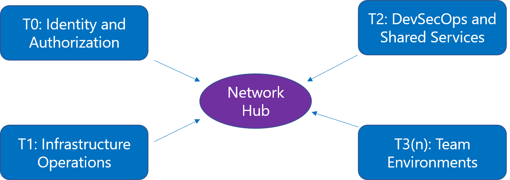

# Mission Landing Zone - Design

[**Home**](../README.md) | [**Design**](./design.md) | [**Add-Ons**](../src/bicep/add-ons/README.md) | [**Resources**](./resources.md)

## Scope

Mission LZ has the following scope:

- Hub and spoke networking intended to comply with SCCA controls
- Predefined spokes for identity, operations, shared services, and workloads
- Ability to create multiple, isolated workloads or team subscriptions
- Remote access
- Compatibility with SCCA compliance (and other compliance frameworks)
- Security using standard Azure tools with sensible defaults
- Azure Policy initiatives

<!-- markdownlint-disable MD033 -->
<!-- allow html for images so that they can be sized -->

<!-- markdownlint-enable MD033 -->

## Networking

Networking is set up in a hub and spoke design, separated by tiers: T0 (Identity and Authorization), T1 (Infrastructure Operations), T2 (DevSecOps and Shared Services), and multiple T3s (Workloads). Access control can be configured to allow separation of duties between all tiers.

<!-- markdownlint-disable MD033 -->
<!-- allow html for images so that they can be sized -->

<!-- markdownlint-enable MD033 -->

Each virtual network has been given a default address prefix to ensure they fall within the default super network. Refer to the [Networking page](./networking.md) for all the default address prefixes.

## Subscriptions

Most customers will deploy each tier to a separate Azure subscription, but multiple subscriptions are not required. A single subscription deployment is good for a testing and evaluation, or possibly a small IT Admin team.

## Firewall

All network traffic is directed through the firewall residing in the Network Hub resource group. The firewall is configured as the default route for all the T0 (Identity and Authorization) through T3 (workload/team environments) resource groups as follows:

| Name          | Address prefix | Next hop type     | Next hop IP address|
|---------------|----------------|-------------------|--------------------|
| default_route | 0.0.0.0/0      | Virtual Appliance | 10.0.128.68        |

The default firewall configured for MLZ is [Azure Firewall Premium](https://docs.microsoft.com/en-us/azure/firewall/premium-features). The Azure Firewall Premium SKU includes the IDPS feature necessary to satisfy the SCCA VDSS requirement. However, if you do not require IDPS, you can optionally deploy Azure Firewall Standard by settings the `firewallSkuTier` parameter to `Standard`.

Presently, there is one rule collection group configured to allow spoke access to the log analytics workspace in the operations spoke. Below is the default collection group configured for Azure Commercial and Azure Government clouds:

| Collection Group          | Rule Collection Priority | Rule Collection Name      | Rule Name       | Source                                   | Destination                            | Port      | Protocol |
|---------------------------|--------------------------|---------------------------|-----------------|-----------------------------------------|----------------------------------------|-----------|----------|
| MLZ-NetworkCollectionGroup | 150                  | AzureMonitor              | AllowMonitorToLAW| 10.0.128.0/23, 10.0.132.0/24, 10.0.130.0/24 (Identity spoke, if present) | 10.0.131.4                            | 443       | Tcp      |

Rules can be added, removed, or changed during deployment by passing in a value to the **`customFirewallRulesCollectionGroups`** parameter. Multiple collection groups can be defined as needed. If the parameter has no value, the template will use the default firewall rules for a secure by default configuration.

Please review [Command Line Tools](./deployment-guides/command-line-tools.md) for more on how to use command line deployments.

To deploy Mission LZ using Azure Stack Hub and an F5 BIG-IP Virtual Edition instead of Azure Firewall Premium, there is an alternate repository with instructions [found here](https://github.com/Azure/missionlz-edge).

## Product Roadmap

See the [Projects](https://github.com/Azure/missionlz/projects) page for the release timeline and feature areas.

Here's a summary of what Mission Landing Zone deploys of as of April 2024:

<!-- markdownlint-disable MD033 -->
<!-- allow html for images so that they can be sized -->

<!-- markdownlint-enable MD033 -->
