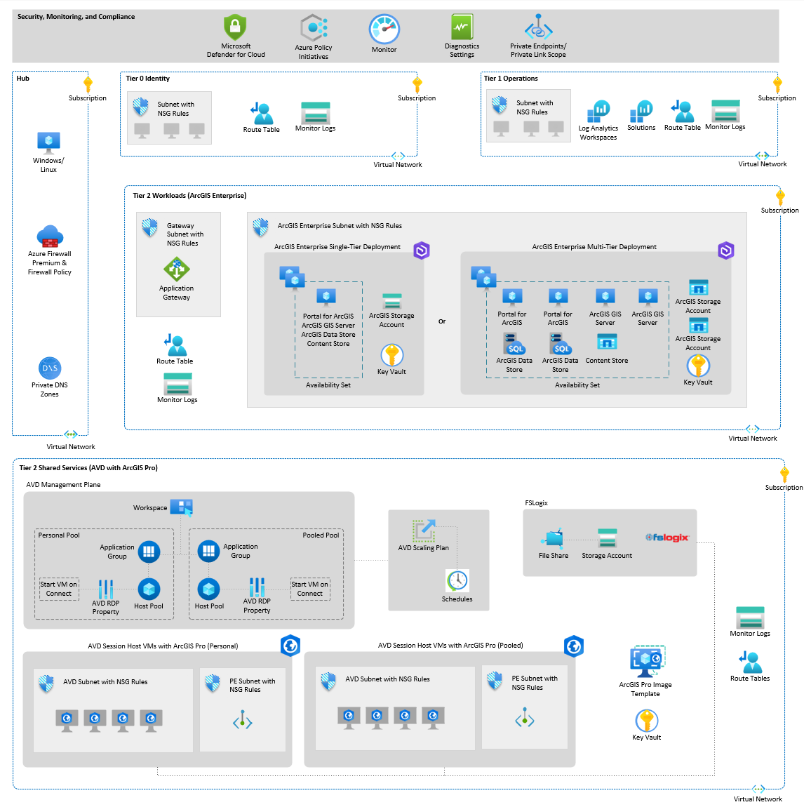
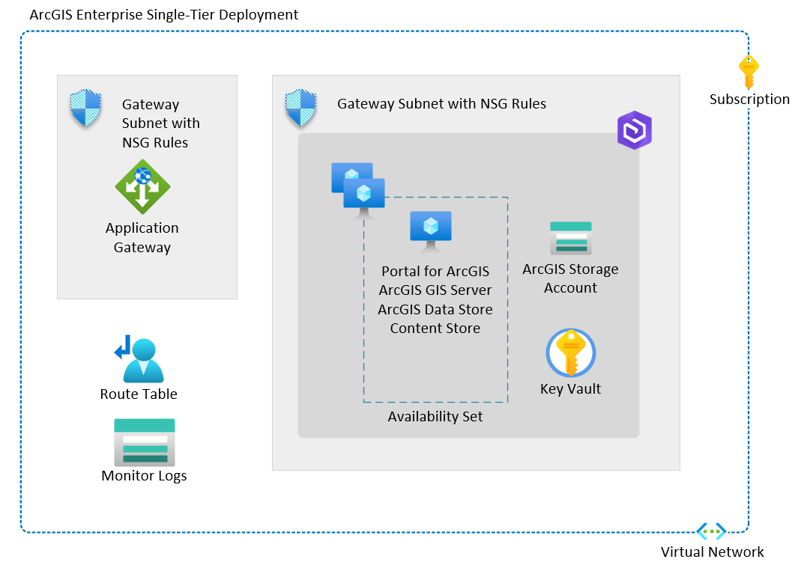
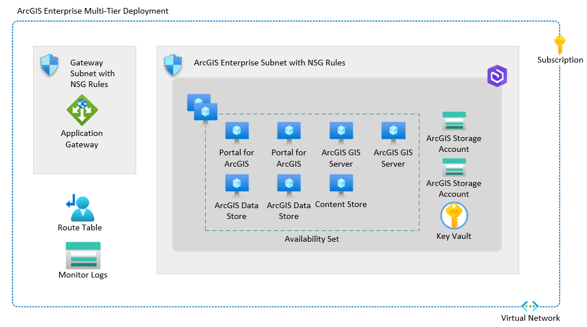

# Welcome to the ArcGIS on Azure with Azure Virtual Desktop (AVD) Landing Zone Accelerator

> [!CAUTION]
> This repository is a WORK-IN-PROGRESS and is not yet fully complete.  

Azure Landing Zone Accelerators are architectural guidance, reference architecture, reference implementations, and automation packaged to deploy workload platforms on Azure at scale and aligned with industry proven practices. This accelerator represents the strategic design path and automated deployment options to deploy Esri’s ArcGIS Enterprise with ArcGIS Pro GPU enabled virtual desktops.

This solution provides an architectural approach and reference implementation to prepare Azure subscriptions for a scalable ArcGIS implementation on Azure, utilizing a combination of Azure cloud native services and traditional infrastructure virtual machines. Once the deployment is completed, users of this accelerator will have a base deployment which enables a rapid deployment of an Enterprise GIS.

For overall architectural guidance on deploying ArcGIS in Azure, check out the Azure Architecture Center documentation -> [Deploy Esri ArcGIS Pro in Azure Virtual Desktop](https://learn.microsoft.com/en-us/azure/architecture/example-scenario/data/esri-arcgis-azure-virtual-desktop). Also, see [Esri's ArcGIS Architecture Center](https://architecture.arcgis.com/).

Below is a diagram of the components of this solution.

The ArcGIS on Azure Landing Zone Accelerator is modular and designed to be usable for organizations that have no Azure infrastructure, as well as those who already have assets in Azure. The path is comprised of four steps, each  may be done sequentially, or not at all depending upon the requierments of your project. However, let's first discuss landing zones.

## What is a Landing Zone?

A [**landing zone**](https://learn.microsoft.com/en-us/azure/cloud-adoption-framework/ready/landing-zone)  is networking & infrastructure configured to provide a secure environment for hosting workloads.

An Azure landing zone consists of platform landing zones and application landing zones.

**Platform landing zone:** A platform landing zone is a subscription that provides shared services (identity, connectivity, management) to applications in application landing zones. Consolidating these shared services often improves operational efficiency. One or more central teams manage the platform landing zones.

**Application landing zone:** An application landing zone is a subscription for hosting an application. You pre-provision application landing zones through code and use management groups to assign policy controls to them. In the conceptual architecture above, the ArcGIS Enterprise Single Machine or Multiple-Machine deployments represent two different application landing zones.

Reference: [ArcGIS Enterprise Single Machine or Multiple-Machine](https://enterprise.arcgis.com/en/server/latest/install/windows/deployment-scenarios.htm)

## Step 1

:arrow_forward: The first step is to deploy [Mission Landing Zone](https://github.com/Azure/missionlz/blob/main/README.md). This allows organizations to start with a foundational landing zone that supports their application portfolios, regardless of whether the applications are being migrated or are newly developed and deployed to Azure.

Mission Landing Zone is a highly opinionated Infrastructure-as-Code (IaC) template which IT oversight organizations can use to create a cloud management system to deploy Azure environments for their workloads and teams. Mission Landing Zone provides a Secure Cloud Computing Architecture (SCCA) compliant hub and spoke network infrastructure.

If you already have an Azure Landing Zone, you can skip this step. For more on what an Azure Landing Zone is, see here -> [Azure Landing Zone](https://learn.microsoft.com/en-us/azure/cloud-adoption-framework/ready/landing-zone).

## Step 2

 :arrow_forward: The second step is to create the Windows image which will be used to create the Azure Virtual Desktops. This image will have ArcGIS Pro pre-installed when you use this template ->  [Zero Trust and Azure Imaging](https://github.com/Azure/missionlz/blob/main/src/bicep/add-ons/imaging/README.md). Be sure to complete the necessary [prerequisites](https://github.com/Azure/missionlz/tree/main/src/bicep/add-ons/imaging#prequisites).

> [!WARNING]
> Failure to complete the [prerequisites](https://github.com/Azure/missionlz/tree/main/src/bicep/add-ons/imaging#prequisites) will result in an unsuccessful deployment.

## Step 3

 :arrow_forward: The third step is to deploy the Azure Virtual Desktop (AVD) solution. This solution provides a fully operational [stamp](https://learn.microsoft.com/azure/architecture/patterns/deployment-stamp) in an Azure subscription adhering  to the [Zero Trust principles](https://learn.microsoft.com/security/zero-trust/azure-infrastructure-avd).

This template represents the strategic design path and target technical state for Azure Virtual Desktop deployment. Many of the [common features](https://github.com/Azure/missionlz/tree/main/src/bicep/add-ons/azure-virtual-desktop/docs/features) used with AVD have been automated in this solution for your convenience.

Be sure to complete the necessary [prerequisites](https://github.com/Azure/missionlz/blob/main/src/bicep/add-ons/azure-virtual-desktop/docs/prerequisites.md) and to review the parameter descriptions to the understand the consequences of your selections. Also, please review Esri's guidance on [VDI and ArcGIS Pro](https://architecture.arcgis.com/en/framework/architecture-practices/architectural-foundations/deployment-concepts/vdi-and-arcgis-pro.html).

This Azure Virtual Desktop Accelerator only deploys the specific Azure Virtual Desktop resources, shown in the architectural diagram above. It is assumed that an appropriate landing zone foundation is already setup. This means that policies and governance should already be in place.

> [!WARNING]
> Failure to complete the [prerequisites](https://github.com/Azure/missionlz/blob/main/src/bicep/add-ons/azure-virtual-desktop/docs/prerequisites.md) will result in an unsuccessful deployment.

## Step 4

 :arrow_forward: The fourth step is to run the ArcGIS Enterprise on Azure accelerator.

There are two primary components to this component in this geospatial accelerator: ArcGIS Pro & ArcGIS Enterprise.

- ArcGIS Pro is a 64-bit professional desktop GIS application. GIS analysts can use it to perform spatial analysis and edit spatial data. GIS administrators can use it to create and publish geospatial services. This app will be deployed on the Windows client virtual machines used as the Azure Virtual Desktop (AVD) hosts. Geospatial analysis in Azure is typically done on GPU optimized virtual desktops.

- ArcGIS Enterprise is a software system for GIS that powers mapping and visualization, analytics, and data management. It is the backbone for running the Esri suite of applications. ArcGIS Enterprise includes ArcGIS Server, which is the core web services component for making maps and performing analysis, and Portal for ArcGIS. ArcGIS Enterprise will be deployed and configured within your landing zone.

> [!NOTE]
> Presently this accelerator performs a base deployment of ArcGIS Enterprise. It does not deploy additonal ArcGIS Enterprise server roles. Once the accelerator is deployed, additional server roles can be deployed on virtual machines in the landing zone.

This automation template will setup Esri's ArcGIS Enterprise in either a [Single Machine or Multiple-Machine](https://enterprise.arcgis.com/en/server/latest/install/windows/deployment-scenarios.htm) deployment as shown in the diagrams. Presently, this base deployment is nearly identical to the [ArcGIS Enterprise Cloud Builder](https://enterprise.arcgis.com/en/server/latest/cloud/azure/what-is-arcgis-server-cloud-builder-for-microsoft-azure.htm).

However, optimizations have been made in this highly opinionated architecture. For example, as part of the deployment, [Azure NetApp Files](https://learn.microsoft.com/en-us/azure/azure-netapp-files/azure-netapp-files-introduction) has been deployed which allows for ArcGIS Pro and Enterprise to share a Network Attached Storage device. ArcGIS Pro users can place GIS datasets on the share.

Also, ArcGIS Enterprise has its [server directories](https://enterprise.arcgis.com/en/server/latest/administer/windows/about-server-directories.htm) located there for fast access to these important components of ArcGIS Enterprise. Also, the Web Adaptor is not deployed. Instead, the Azure Application Gateway is used as the load balancing solution.

Once everything is deployed, users will need to consider how to migrate their data, applications, and configuration to this new environment. This includes ArcGIS Enterprise services, Enterprise geodatabase, Portal for ArcGIS configuration, etc.

See Esri's documentation [here](https://enterprise.arcgis.com/en/portal/latest/administer/windows/migration-strategies.htm) and [here](https://architecture.arcgis.com/en/framework/architecture-practices/architectural-foundations/deployment-concepts/enterprise-and-cloud-migration.html) for advice on migrations.

See this [video](https://mediaspace.esri.com/media/t/1_6iw4ydg1) for a full discussion on migration options.

## Choosing a Deployment Model

The below automation templates can be deployed in your Azure subscriptions by clicking the blue buttons.

## Mission Landing Zone

[Mission Landing Zone](https://github.com/Azure/missionlz/blob/main/README.md) is a highly opinionated Infrastructure-as-Code (IaC) template which IT organizations can use to create a cloud management system in Azure for their workloads and teams. Mission Landing Zone provides a Secure Cloud Computing Architecture (SCCA) compliant hub and spoke infrastructure.

You must have [Owner RBAC permissions](https://docs.microsoft.com/en-us/azure/role-based-access-control/built-in-roles#owner) on the subscription(s) you deploy Mission Landing Zone into. See [prerequisites](https://github.com/Azure/missionlz/blob/main/docs/deployment-guide-bicep.md#prerequisites) for additional guidance.

<!-- markdownlint-disable MD013 -->
1. Deploy Mission Landing Zone into `AzureCloud` or `AzureUsGovernment` from the Azure Portal:

    | Azure Commercial | Azure Government |
    | :--- | :--- |
    |  |  |
<!-- markdownlint-enable MD013 -->

## Azure Zero Trust Imaging

This [Azure Zero Trust Imaging](https://github.com/Azure/missionlz/blob/main/src/bicep/add-ons/Imaging/README.md) solution creates images using a zero trust process and resources. While other options exist in Azure, its either a manual process or it doesn't adhere to zero trust.

<!-- markdownlint-disable MD013 -->
1. Deploy Zero Trust Imaging into `AzureCloud` or `AzureUsGovernment` from the Azure Portal:

    | Azure Commercial | Azure Government |
    | :--- | :--- |
    | |  |
<!-- markdownlint-enable MD013 -->

## The Azure Virtual Desktop (AVD) solution

The [Azure Virtual Desktop (AVD) solution](https://github.com/Azure/missionlz/tree/main/src/bicep/add-ons/azure-virtual-desktop#readme) provides an architectural approach and reference implementation to prepare landing zone subscriptions for a scalable Azure Virtual Desktop deployment. Be sure to complete the necessary [prerequisites](https://github.com/Azure/missionlz/blob/main/src/bicep/add-ons/azure-virtual-desktop/docs/prerequisites.md)

<!-- markdownlint-disable MD013 -->
1. Deploy The Azure Virtual Desktop (AVD) solution into `AzureCloud` or `AzureUsGovernment` from the Azure Portal:

    | Azure Commercial | Azure Government |
    | :--- | :--- |
    | |  |
<!-- markdownlint-enable MD013 -->

## ArcGIS on Azure

In this ArcGIS on Azure accelerator, you have access to step by step guides covering various customer scenarios that can help accelerate the deployment of ArcGIS on Azure which conforms with best practices. This is a good starting point if you are **new** to Azure or Infrastructure-As-Code (IaC) . Each scenario represents common use cases, with the goal of accelerating the deployment process.

### ArcGIS Enterprise base deployment single machine

This option will deploy ArcGIS Enterprise on one virtual server, which is suitable  for Prof-of-Concept implementations or demo environments.

### ArcGIS Enterprise base deployment single tier

This option will deploy ArcGIS Enterprise on one Virutal Server, which is suiteable for Prof-of-Concept implementations.

<!-- markdownlint-disable MD013 -->
| Deployment Type | Link |
|:--|:--|
| Azure portal UI |   |
<!-- markdownlint-enable MD013 -->

### ArcGIS Enterprise base deployment multi tier

This option will deploy ArcGIS Enterprise across multiple virtual machines, which is more suitable for production implementations which require high availability.

#### Pre-Reqs

If deploying ArcGIS Enterprise please follow the below guidance and pre-req steps:

##### Upload the following scripts and files to your storage account container

- [Az.Accounts 2.13.1 PowerShell Module](https://www.powershellgallery.com/api/v2/package/Az.Accounts/2.13.1)
- [Az.Automation 1.9.0 PowerShell Module](https://www.powershellgallery.com/api/v2/package/Az.Automation/1.9.0)
- [Az.Compute 5.7.0 PowerShell Module](https://www.powershellgallery.com/api/v2/package/Az.Compute/5.7.0)
- [Az.Resources 6.6.0 PowerShell Module](https://www.powershellgallery.com/api/v2/package/Az.Resources/6.6.0)
- [Az.KeyVault 4.12.0 PowerShell Module](https://www.powershellgallery.com/api/v2/package/Az.Resources/6.6.0)
- [Az.Storage 5.1.0 PowerShell Module](https://www.powershellgallery.com/api/v2/package/Az.Storage/5.1.0)
- [Az.MarketplaceOrdering 2.0.0 PowerShell Module](https://www.powershellgallery.com/api/v2/package/Az.MarketplaceOrdering/2.0.0)
- [PFX Certificate for ESRI Enterprise that is password protected](https://enterprise.arcgis.com/en/server/latest/administer/windows/best-practices-for-server-certificates.htm)

<!-- markdownlint-disable MD013 -->
| Deployment Type | Link |
|:--|:--|
| Azure portal UI |   |
<!-- markdownlint-enable MD033 -->

If you would like step by step guidance on how to deploy ESRI’s ArcGIS Enterprise on Azure and access it with ArcGIS Pro GPU enabled Azure virtual desktops, check out the Azure Architecture Center documentation: [Deploy Esri ArcGIS Pro in Azure Virtual Desktop](https://learn.microsoft.com/en-us/azure/architecture/example-scenario/data/esri-arcgis-azure-virtual-desktop).

## More options for quick start automated deployments for Azure Landing Zones

:arrow_forward: [What is an Azure landing zone?](https://learn.microsoft.com/en-us/azure/cloud-adoption-framework/ready/landing-zone/)

:arrow_forward: [Implement Cloud Adoption Framework enterprise-scale landing zones in Azure](https://learn.microsoft.com/en-us/azure/cloud-adoption-framework/ready/enterprise-scale/implementation)

### Or check out one of our other application Landing Zone Accelerators

:arrow_forward: [Deploy Azure application landing zones](https://learn.microsoft.com/en-us/azure/architecture/landing-zones/landing-zone-deploy#application)
