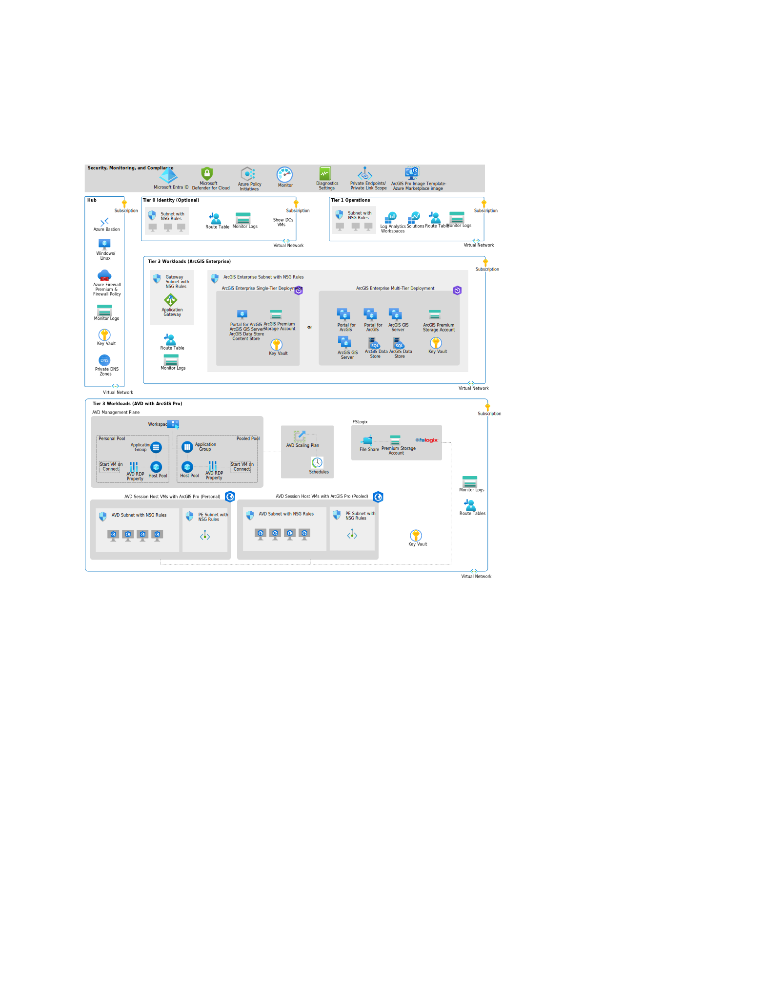

# Esri ArcGIS Pro on Azure Virtual Desktop (AVD) Accelerator

> [!CAUTION]
> This repository is a WORK-IN-PROGRESS and is not yet fully complete.  

## Overview

Azure Landing Zone Accelerators provide architectural guidance, reference architectures, implementations, and automation to deploy workload platforms on Azure at scale, following industry best practices. This accelerator focuses on deploying Esri’s ArcGIS Enterprise with ArcGIS Pro on GPU-enabled virtual desktops.

## What is a Landing Zone?

A landing zone is a configured environment for hosting workloads securely. It includes:

**Platform Landing Zone:** Provides shared services (identity, connectivity, management) to applications. 
**Application Landing Zone:** Hosts applications, pre-provisioned through code, with policy controls assigned via management groups.

Click here for more details on [**Landing Zones**](https://learn.microsoft.com/en-us/azure/cloud-adoption-framework/ready/landing-zone)

## Solution Description

This accelerator offers an architectural approach and reference implementation to prepare Azure subscriptions for scalable ArcGIS deployments. It combines Azure cloud-native services and traditional infrastructure virtual machines. Upon completion, users will have a base deployment for rapid Enterprise GIS adoption.

**Major Benefits:**

<ul>
  <li><b>Enhanced Performance:</b> ArcGIS Pro on AVD leverages GPU-enabled virtual desktops, providing significant performance improvements for rendering and processing complex geospatial datasets. This is particularly beneficial for high-end cartography and extensive analysis.</li>
  <li><b>Scalability:</b> Azure's scalable resources ensure that ArcGIS Pro can handle varying workloads, from light 2D workflows to demanding 3D visualizations. This flexibility allows organizations to scale their GIS operations as needed.</li>
  <li><b>Cost Efficiency:</b> AVD offers cost-saving options through pooled and personal desktop configurations. Pooled desktops maximize resource sharing and minimize idle capacity, while personal desktops provide dedicated resources for individual users.</li>
  <li><b>Remote Access:</b> GIS professionals can remotely access the right virtual desktop pool for their work, whether it be map creation, geovisualization, or advanced geospatial analysis. This remote access capability enhances productivity and collaboration.</li>
  <li><b>Security and Compliance:</b> AVD provides a secure environment with features like single sign-on, passwordless authentication, and integration with Microsoft Entra and third-party identity providers. This ensures that GIS data and applications are protected.</li>
  <li><b>Simplified Management:</b> IT administrators can easily manage and deploy ArcGIS Pro on AVD using automation templates and Azure's management tools. This simplifies the deployment process and reduces administrative overhead.</li>
  <li><b>High Availability:</b> Multi-tier deployments of ArcGIS Enterprise across multiple virtual machines ensure high availability and reliability for production implementations.</li>
</ul>

**Components:**

The Esri ArcGIS Pro on Azure Virtual Desktop Accelerator is modular and suitable for organizations with or without existing Azure infrastructure. It is is an add-on to the Mission Landing Zone deployment, and, as such,  consists of two steps. **Step 1** involves deploying Mission Landing Zone. If you have not deployed Mission Landing Zone, you can do that here: [Mission Landing Zone Deployment](https://github.com/Azure/missionlz). Once you deploy Mission Landing Zone, you are ready to complete **Step 2** and deploy the Esri ArcGIS Pro on Azure Virtual Desktop Accelerator. For this accelerator you have two deployement options, single-teir or multi-tier:

## Single-Tier Deployment

The single-tier deployment involves installing all components of ArcGIS Enterprise on a single virtual machine. This setup is straightforward and suitable for smaller implementations or proof-of-concept projects. It is ideal for organizations that:

<ul>
  <li>Have limited resources and need a simple, cost-effective solution.</li>
  <li>Are conducting initial testing or development.</li>
  <li>Do not require high availability or scalability.</li>
</ul>

**Benefits:** 

<ul>
  <li><b>Simplicity:</b> Easier to set up and manage since all components are on one machine.</li>
  <li><b>Cost-Effective:</b> Lower infrastructure costs as it requires fewer resources.</li>
  <li><b>Quick Deployment:</b> Faster to deploy and configure, making it suitable for short-term projects.</li>
</ul>

<!-- markdownlint-disable MD013 -->
| Deployment Type | Link |
|:--|:--|
| Azure portal UI |   |
<!-- markdownlint-enable MD013 -->

## Multi-Tier Deployment

A multi-tier deployment involves distributing the components of ArcGIS Enterprise across multiple virtual machines. This setup is more complex but offers better performance, scalability, and high availability. It is ideal for organizations that:

<ul>
  <li>Require a robust and scalable solution for production environments.</li>
  <li>Need to support a large number of users and high-demand applications.</li>
  <li>Require high availability and disaster recovery capabilities.</li>
</ul>

**Benefits:** 

<ul>
  <li>Scalability: Can handle larger workloads and more users by distributing components across multiple machines.</li>
  <li>High Availability: Provides redundancy and failover capabilities, ensuring continuous operation.</li>
  <li>Performance: Improved performance as different components can be optimized and scaled independently</li>
</ul>

<!-- markdownlint-disable MD013 -->
| Deployment Type | Link |
|:--|:--|
| Azure portal UI |   |
<!-- markdownlint-enable MD033 -->

## Who Would Use Each? 

<ul>
<li>Single-Tier Deployment: Suitable for small organizations, initial testing, development environments, or proof-of-concept projects where simplicity and cost-effectiveness are key.</li>
<li>Multi-Tier Deployment: Suitable for larger organizations, production environments, or projects requiring high availability, scalability, and robust performance.</li>
</ul>

Click here for additional ArcGIS archtiecture resources: **ArcGIS on Azure**(https://learn.microsoft.com/en-us/azure/architecture/example-scenario/data/esri-arcgis-azure-virtual-desktop) or **Esri Architecture Center**(https://architecture.arcgis.com/)

If you would like step by step guidance on how to deploy ESRI’s ArcGIS Enterprise on Azure and access it with ArcGIS Pro GPU enabled Azure virtual desktops, check out the Azure Architecture Center documentation: [Deploy Esri ArcGIS Pro in Azure Virtual Desktop](https://learn.microsoft.com/en-us/azure/architecture/example-scenario/data/esri-arcgis-azure-virtual-desktop).

## More options for quick start automated deployments for Azure Landing Zones

:arrow_forward: [What is an Azure landing zone?](https://learn.microsoft.com/en-us/azure/cloud-adoption-framework/ready/landing-zone/)

:arrow_forward: [Implement Cloud Adoption Framework enterprise-scale landing zones in Azure](https://learn.microsoft.com/en-us/azure/cloud-adoption-framework/ready/enterprise-scale/implementation)

### Or check out one of our other application Landing Zone Accelerators

:arrow_forward: [Deploy Azure application landing zones](https://learn.microsoft.com/en-us/azure/architecture/landing-zones/landing-zone-deploy#application)
