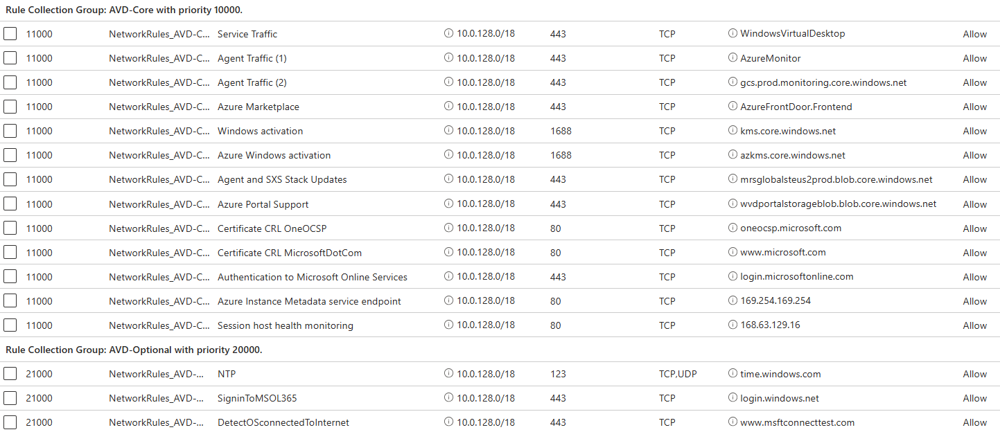

# Missiong Landing Zone - Security & Compliance Settings

[**Home**](../README.md) | [**Design**](./design.md) | [**Add-Ons**](../src/bicep/add-ons/README.md) | [**Resources**](./resources.md)

**The following security settings and compliance features are available during the Mission Landing Zone deployment process:**

## Azure Policy

Azure policy is a service that provides the ability to implement governance for resource consistency, regulatory compliance, security, cost, and management. Below are the available regulatory compliance policies that can be enabled during the deployment process:

**NIST SP 800-53 Rev4:** National Institute of Standards and Technology (NIST) SP 800-53 R4 provides a standardized approach for assessing, monitoring and authorizing cloud computing products and services to manage information security risk. These policies address a subset of NIST SP 800-53 R4 controls. For more information, visit [https://aka.ms/nist800-53r4-initiative](https://aka.ms/nist800-53r4-initiative).

**NIST SP 800-53 Rev5:** National Institute of Standards and Technology (NIST) SP 800-53 Rev. 5 provides a standardized approach for assessing, monitoring and authorizing cloud computing products and services to manage information security risk. These policies address a subset of NIST SP 800-53 R5 controls. For more information, visit [https://aka.ms/nist800-53r5-initiative](https://aka.ms/nist800-53r5-initiative).

**DoD IL5:** This initiative includes policies that address a subset of DoD Impact Level 5 (IL5) controls. These policies are only available for AzureUSGovernment and will switch to NISTRev4 if tried in Azure Commercial. For more information, visit [https://aka.ms/dodil5-initiative](https://aka.ms/dodil5-initiative).

**Cybersecurity Maturity Model Certification (CMMC):** This initiative includes policies that address a subset of Cybersecurity Maturity Model Certification (CMMC) Level 3 requirements. For more information, visit [https://aka.ms/cmmc-initiative](https://aka.ms/cmmc-initiative).

## Defender for Cloud

Defender for Cloud is a Cloud Security Posture Management (CSPM) solution that helps you find and fix security vulnerabilities. Defender for Cloud also applies access and application controls to block malicious activity, detect threats, and respond quickly when under attack.

MLZ can be deployed with the free Foundational Cloud Security Posture Management features. For enhanced protection, there is an option for activating paid features such as Defender for Cloud Security Posture Management and Workload Protection Plans for additional threat protection. Below are the additional features available for enabling:

- Defender for CSPM
- Defender for Servers
- Defender for API
- Defender for App Services
- Defender for Resource Manager
- Defender for Azure Cosmos DB
- Defender for Key Vault
- Defender for open-source relational databases
- Defender for SQL Server on machines
- Defender for Azure SQL
- Defender for Storage
- Defender for Containers

## Sentinel

Sentinel is Microsoft’s Security Information and Event Management (SIEM) and Security orchestration, automation, and response (SOAR) solution. With Microsoft Sentinel, you get a single solution for attack detection, threat visibility, proactive hunting, and threat response. A Log Analytics Workspace is created and deployed specifically for Sentinel to collect log data from multiple services.
A Data Connector is deployed to import data from Microsoft Entra to track resource activity.

Please note further configuration of Sentinel is required to take advantage of threat detection, log retention and response capabilities.

**Log Analytics Workspace name:**

- **log-operations-test-use**

**Data Connector:**

- **Azure Activity:** Azure Activity Log is a subscription log that provides insight into subscription-level events that occur in Azure, including events from Azure Resource Manager operational data, service health events, write operations taken on the resources in your subscription, and the status of activities performed in Azure.

## Azure Firewall Post-Configurations

<!-- markdownlint-disable MD013 -->
Azure Firewall is a cloud-native and intelligent network firewall security service that provides the best threat protection for your cloud workloads running in Azure. It's a fully stateful firewall as a service with built-in high availability and unrestricted cloud scalability. For each rule, you can specify source and destination, port, and protocol. The following table is the list of FQDNs and endpoints your session host VMs need to access for Azure Virtual Desktop.
<!-- markdownlint-enable MD013 -->

### Firewall Policy

<!-- markdownlint-disable MD013 -->
You can use Firewall Policy to manage rule sets that Azure Firewall uses to filter traffic. Firewall policy organizes, prioritizes, and processes the rule sets based on a hierarchy. To allow the flow of communication for MLZ AVD resources, the **mlz-afw-hub-xxx-use2** azure firewall needs to have rules added to allow this communication to flow. The requried steps to allow successful communication includes adding network rules and application rules by modifying the MLZ firewall policy, **mlz-afwp-hub-xxx-ues2**. The rules that are deployed with this policy should be removed and replaced with the below network and application rules.
<!-- markdownlint-enable MD013 -->

### Rule Collection Groups

A rule collection group is used to group rule collections. They're the first unit that the firewall processes, and they follow a priority order based on values. Below is an example of rule collection groups that should be created to manage AVD network communications.

### Priority Processing

<!-- markdownlint-disable MD013 -->
Rules are processed based on Rule Collection Group Priority and Rule Collection priority. Priority is any number between 100 (highest priority) to 65,000 (lowest priority). When adding rules for MLZ AVD communication, consider the priority of each rule as they are processed in a priority order. Refer to the ***Rule processing using Firewall Policy*** link under the Reference links section for additional information.
<!-- markdownlint-enable MD013 -->

### Network Rules

<!-- markdownlint-disable MD013 -->
Network rules allow or deny inbound and outbound traffic. You can use a network rule when you want to filter traffic based on IP addresses, any ports, and any protocols. The **mlz-afwp-hub-xxx-ues2** firewall policy should have the below rules added to allow AVD communication flow properly. Below are the rules for Azure Commercial and Azure Government. Please refer to the reference links section for information on additional optional Microsoft service endpoints that may need to be added to your firewall or NSGs to ensure proper access.
<!-- markdownlint-enable MD013 -->

- **Azure Commercial**

- **Azure Government**

### Application Rules

Application rules allow or deny outbound traffic. You can use an application rule when you want to filter traffic based on fully qualified domain names (FQDNs), URLs, and HTTP/HTTPS protocols.The below application rules should be added to the firewall policy to allow AVD communication.

- **Azure Commercial**

- **Azure Government**

### NSG Security Rules

<!-- markdownlint-disable MD013 -->
For the MLZ NSG's, the same rules that were added to the Azure Firewall as post-configuration settings should be added as security rules as part of the defense in depth, layered defensive best practices. When adding these rules to the NSG's, make note that NSG's do not support FQDN's as a rule processing type. Instead of using FQDN rules, the NSG should be configured to allow all traffic for each specified port in the Destination filter. Each NSG rule should be configured to have a source CIDR range, source port number, and the destination filter configured to 'Any'. This allows all of the required FQDN's to pass through the Azure Firewall as the first layer of defense, followed by the NSG's as the second layer of defense.
<!-- markdownlint-enable MD013 -->

- **Azure Commercial**

- **Azure Government**
 

***References links:***

- [Azure Firewall Policy rule sets](https://learn.microsoft.com/en-us/azure/firewall/policy-rule-sets)

- [Required FQDNs and endpoints for Azure Virtual Desktops](https://learn.microsoft.com/en-us/azure/virtual-desktop/required-fqdn-endpoint?tabs=azure)

- [Rule processing using Firewall Policy](https://learn.microsoft.com/en-us/azure/firewall/rule-processing#rule-processing-using-firewall-policy)

- [Proxy server guidelines for Azure Virtual Desktop](https://learn.microsoft.com/en-us/azure/virtual-desktop/proxy-server-support)

- [Microsoft 365 URL and IP address ranges](https://learn.microsoft.com/en-us/microsoft-365/enterprise/urls-and-ip-address-ranges?view=o365-worldwide)

- [Microsoft 365 U.S. Government DoD endpoints](https://learn.microsoft.com/en-us/microsoft-365/enterprise/microsoft-365-u-s-government-dod-endpoints?view=o365-worldwide)

## Customer Responsibilities

There are additional security best practices which should be implemented after deploying a Mission Landing Zone that are specific to each customer’s environment. Below are links that provide guidance on how to configure these features.

- [Deploy STIG-compliant Windows Virtual Machines](https://learn.microsoft.com/en-us/azure/azure-government/documentation-government-stig-windows-vm)

- [Centralize Identity Management](https://learn.microsoft.com/en-us/azure/security/fundamentals/identity-management-best-practices?bc=%2Fazure%2Fcloud-adoption-framework%2F_bread%2Ftoc.json&toc=%2Fazure%2Fcloud-adoption-framework%2Ftoc.json#centralize-identity-management)

- [Enable Single Sign-On](https://learn.microsoft.com/en-us/azure/security/fundamentals/identity-management-best-practices?bc=%2Fazure%2Fcloud-adoption-framework%2F_bread%2Ftoc.json&toc=%2Fazure%2Fcloud-adoption-framework%2Ftoc.json#enable-single-sign-on)

- [Turn on Conditional Access](https://learn.microsoft.com/en-us/azure/security/fundamentals/identity-management-best-practices?bc=%2Fazure%2Fcloud-adoption-framework%2F_bread%2Ftoc.json&toc=%2Fazure%2Fcloud-adoption-framework%2Ftoc.json#turn-on-conditional-access)

- [Enable Password Management](https://learn.microsoft.com/en-us/azure/security/fundamentals/identity-management-best-practices?bc=%2Fazure%2Fcloud-adoption-framework%2F_bread%2Ftoc.json&toc=%2Fazure%2Fcloud-adoption-framework%2Ftoc.json#enable-password-management)

- [Enforce Multifactor Verification for Users](https://learn.microsoft.com/en-us/azure/security/fundamentals/identity-management-best-practices?bc=%2Fazure%2Fcloud-adoption-framework%2F_bread%2Ftoc.json&toc=%2Fazure%2Fcloud-adoption-framework%2Ftoc.json#enforce-multifactor-verification-for-users)

- [User Role-Based Access Control](https://learn.microsoft.com/en-us/azure/security/fundamentals/identity-management-best-practices?bc=%2Fazure%2Fcloud-adoption-framework%2F_bread%2Ftoc.json&toc=%2Fazure%2Fcloud-adoption-framework%2Ftoc.json#use-role-based-access-control)

- [Lower Exposure of Privileged Accounts](https://learn.microsoft.com/en-us/azure/security/fundamentals/identity-management-best-practices?bc=%2Fazure%2Fcloud-adoption-framework%2F_bread%2Ftoc.json&toc=%2Fazure%2Fcloud-adoption-framework%2Ftoc.json#lower-exposure-of-privileged-accounts)

- [Control Locations Where Resources are Created](https://learn.microsoft.com/en-us/azure/security/fundamentals/identity-management-best-practices?bc=%2Fazure%2Fcloud-adoption-framework%2F_bread%2Ftoc.json&toc=%2Fazure%2Fcloud-adoption-framework%2Ftoc.json#control-locations-where-resources-are-created)

- [Actively Monitor for Suspicious Activities](https://learn.microsoft.com/en-us/azure/security/fundamentals/identity-management-best-practices?bc=%2Fazure%2Fcloud-adoption-framework%2F_bread%2Ftoc.json&toc=%2Fazure%2Fcloud-adoption-framework%2Ftoc.json#actively-monitor-for-suspicious-activities)

- [Use Microsoft Entra ID for Storage Authentication](https://learn.microsoft.com/en-us/azure/security/fundamentals/identity-management-best-practices?bc=%2Fazure%2Fcloud-adoption-framework%2F_bread%2Ftoc.json&toc=%2Fazure%2Fcloud-adoption-framework%2Ftoc.json#use-microsoft-entra-id-for-storage-authentication)

## Planned Changes

- DoD Zero Trust Workbook
