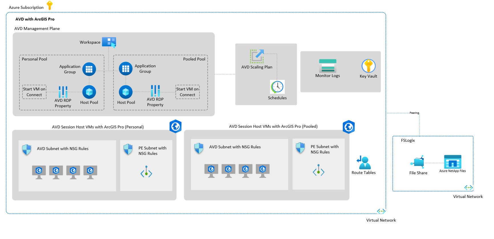

# ArcGIS Pro Add-On

This workload accelerator offers an architectural approach and reference implementation to prepare Azure subscriptions for scalable ArcGIS deployments. It combines Azure cloud-native services and traditional infrastructure virtual machines. Upon completion, users will have a base deployment for rapid enterprise GIS adoption.

## Quick Start Summary

- **Scenario 1:** [ArcGIS Pro on Azure Virtual Desktop (AVD)](#scenario-1-arcgis-pro-on-avd)
- **Scenario 2:** [Single-Tier Deployment (ArcGIS Enterprise + ArcGIS Pro on AVD)](#scenario-2-single-tier-deployment-arcgis-enterprise--arcgis-pro-on-avd)
- **Scenario 3:** [Multi-Tier Deployment (ArcGIS Enterprise + ArcGIS Pro on AVD)](#scenario-3-multi-tier-deployment-arcgis-enterprise--arcgis-pro-on-avd)
- **Who Would Use Each:** [Guidance on Choosing the Right Deployment Scenario](#who-would-use-each)

## Prerequisites

Before deploying this accelerator, ensure you have the following:

### Azure Requirements

- **Azure Subscription:** An active Azure subscription with sufficient quota for the required resources (VMs, storage, networking).
- **Permissions:** Owner or Contributor role on the target subscription, plus User Access Administrator for role assignments.
- **Mission Landing Zone:** A deployed instance of [Mission Landing Zone](https://github.com/Azure/missionlz) — this accelerator builds on top of MLZ's foundational infrastructure.
- **Supported Regions:** Ensure your target Azure region supports Azure Virtual Desktop and GPU-enabled VM SKUs (e.g., NVads V710, NVadsA10_v5, NCasT4_v3 series).
- **Resource Providers:** Register the required Azure resource providers and features before deployment.

#### Enable Required Features and Resource Providers

Run the following PowerShell commands to register the necessary features and providers:

```powershell
# Set your subscription context
Set-AzContext -SubscriptionId "<yourSubIDHere>"

# Enable Encryption At Host feature
# Reference: https://learn.microsoft.com/azure/virtual-machines/disks-enable-host-based-encryption-portal?tabs=azure-powershell#prerequisites
Register-AzProviderFeature -FeatureName "EncryptionAtHost" -ProviderNamespace "Microsoft.Compute"

# Register Azure NetApp Files resource provider and feature
Register-AzResourceProvider -ProviderNamespace "Microsoft.NetApp"
Register-AzProviderFeature -FeatureName "ANFMultipleActiveDirectory" -ProviderNamespace "Microsoft.NetApp"

# Register Desktop Virtualization resource provider
Register-AzResourceProvider -ProviderNamespace "Microsoft.DesktopVirtualization"

# Verify registration status (may take a few minutes)
Get-AzProviderFeature -FeatureName "EncryptionAtHost" -ProviderNamespace "Microsoft.Compute"
Get-AzProviderFeature -FeatureName "ANFMultipleActiveDirectory" -ProviderNamespace "Microsoft.NetApp"
Get-AzResourceProvider -ProviderNamespace "Microsoft.DesktopVirtualization" | Select-Object ProviderNamespace, RegistrationState
```

> [!NOTE]
> Feature registration can take several minutes to complete. Wait until the `RegistrationState` shows `Registered` before proceeding with deployment.

### ArcGIS Licensing

- **ArcGIS Pro License:** Valid Named User or Concurrent Use license for ArcGIS Pro.
- **ArcGIS Online or Enterprise Portal:** An ArcGIS Online organization or ArcGIS Enterprise portal for user authentication and licensing (required for Named User licenses).
- **Esri License Server (optional):** For Concurrent Use licensing, a configured Esri License Server is required.

### Network & Identity

- **Microsoft Entra ID:** Users must be synced or created in Microsoft Entra ID for AVD authentication.
- **Network Connectivity:** Outbound internet access for ArcGIS licensing, updates, and optional ArcGIS Online connectivity.
- **DNS Configuration:** Proper DNS resolution for internal resources and ArcGIS services.

### Recommended Knowledge

- Familiarity with Azure Virtual Desktop concepts and management.
- Basic understanding of ArcGIS Pro deployment and licensing models.
- Experience with Azure Bicep or ARM templates (for customization).

---

## Who is this for?

This accelerator is designed for GIS administrators, IT/cloud architects, and organizations looking to modernize their GIS infrastructure by leveraging Azure's scalability, performance, and security. Whether you're migrating from on-premises or expanding your cloud footprint, this solution provides the tools and guidance needed for successful deployment.

## Major Benefits

This accelerator provides a modern, cloud-native foundation for deploying ArcGIS Pro and ArcGIS Enterprise on Azure. Benefits span both desktop GIS performance and enterprise GIS infrastructure modernization:

### 🔷 ArcGIS Pro on Azure Virtual Desktop (AVD)

- **Enhanced Performance:** GPU-enabled virtual desktops deliver fast rendering and processing for complex 2D/3D geospatial workflows.
- **Remote Access:** Users can securely access ArcGIS Pro from anywhere, enabling hybrid and distributed teams.
- **Cost Optimization:** Flexible pricing with pooled or personal desktops reduces idle capacity and aligns with usage patterns.
- **Simplified Management:** Centralized provisioning, updates, and policy enforcement streamline IT operations.

### ☁️ ArcGIS Enterprise on Azure

- **Elastic Scalability:** Easily scale compute, storage, and services to meet growing user and data demands — without hardware constraints.
- **High Availability & Resilience:** Azure-native features like availability zones, load balancing, and backup services improve uptime and disaster recovery.
- **Security & Compliance:** Benefit from Azure’s enterprise-grade security, identity integration (Microsoft Entra ID), and compliance certifications.
- **Operational Efficiency:** Automate deployments with infrastructure-as-code (Bicep/ARM), reducing manual setup and configuration time.
- **Global Reach:** Deploy closer to your users with Azure’s global data center footprint, improving performance and reducing latency.
- **Integration Ready:** Seamlessly connect ArcGIS Enterprise with other Azure services (e.g., Azure SQL, Azure Maps, AI/ML tools) for advanced workflows.

## Components

This accelerator is designed to deploy [Mission Landing Zone](https://github.com/Azure/missionlz) first. Mission Landing Zone provides the foundational Azure infrastructure (identity, networking, security, and governance) required to support ArcGIS workloads. Depending on your needs, you can choose from three deployment scenarios:

- **Scenario 1:** ArcGIS Pro on Azure Virtual Desktop (AVD)

- **Scenario 2:** Single-Tier ArcGIS Enterprise + ArcGIS Pro on AVD
- **Scenario 3:** Multi-Tier ArcGIS Enterprise + ArcGIS Pro on AVD

> [!NOTE]
> Scenarios 2 and 3 are under development and coming soon.

Each scenario is self-contained and can be deployed independently, depending on your organization's GIS architecture and operational goals.

## Scenario 1: ArcGIS Pro on AVD

ArcGIS Pro on Azure Virtual Desktop (AVD) provides a modern, cloud-based solution for delivering high-performance GIS desktops to users anywhere. This deployment scenario focuses on enabling GIS professionals to access GPU-accelerated ArcGIS Pro sessions remotely, without the need for local high-end hardware.

This scenario is ideal for organizations that:

- Need to provide remote access to ArcGIS Pro for distributed teams or hybrid workforces.
- Want to leverage GPU-enabled virtual desktops for intensive 2D/3D geospatial analysis and visualization.
- Require flexible, scalable desktop environments that can be pooled or assigned per user.

**Benefits:**

- **Remote Productivity:** Users can access ArcGIS Pro from virtually anywhere, enabling collaboration across geographies.
- **GPU Acceleration:** Delivers high-performance rendering and analysis for demanding GIS workflows.
- **Centralized Management:** Simplifies IT operations with centralized updates, security policies, and user provisioning.
- **Cost Optimization:** Offers flexible pricing models with pooled or personal desktops to match usage patterns.
- **Secure Access:** Integrates with Microsoft Entra ID and supports conditional access, MFA, and other enterprise-grade security features.

<!-- markdownlint-disable MD013 -->
[](https://portal.azure.com/#blade/Microsoft_Azure_CreateUIDef/CustomDeploymentBlade/uri/https%3A%2F%2Fraw.githubusercontent.com%2FAzure%2Fmissionlz%2Fmain%2Fsrc%2Fadd-ons%2Farcgis-pro%2Fsolution.json/uiFormDefinitionUri/https%3A%2F%2Fraw.githubusercontent.com%2FAzure%2Fmissionlz%2Fmain%2Fsrc%2Fadd-ons%2Farcgis-pro%2FuiDefinition.json) [](https://portal.azure.us/#blade/Microsoft_Azure_CreateUIDef/CustomDeploymentBlade/uri/https%3A%2F%2Fraw.githubusercontent.com%2FAzure%2Fmissionlz%2Fmain%2Fsrc%2Fadd-ons%2Farcgis-pro%2Fsolution.json/uiFormDefinitionUri/https%3A%2F%2Fraw.githubusercontent.com%2FAzure%2Fmissionlz%2Fmain%2Fsrc%2Fadd-ons%2Farcgis-pro%2FuiDefinition.json)
<!-- markdownlint-enable MD013 -->

## Scenario 2: Single-Tier Deployment (ArcGIS Enterprise + ArcGIS Pro on AVD)

> [!NOTE]
> This scenario is under development and coming soon.

## Scenario 3: Multi-Tier Deployment (ArcGIS Enterprise + ArcGIS Pro on AVD)

> [!NOTE]
> This scenario is under development and coming soon.

## Who Would Use Each?

Choosing the right deployment scenario depends on your GIS goals, collaboration needs, and infrastructure preferences:

### Scenario 1: ArcGIS Pro on Azure Virtual Desktop (AVD)

Ideal for users who need high-performance desktop GIS capabilities with remote access. This scenario is especially useful when:

- You already use **ArcGIS Online** for sharing and collaboration and just need better hardware or centralized desktop access.
- You work with local or cloud-hosted data but don’t need to manage your own GIS server infrastructure.
- You want to enable GPU-accelerated workflows for 2D/3D analysis, cartography, or geoprocessing.

> [!NOTE]
> ArcGIS Pro can connect directly to ArcGIS Online, making this scenario a great fit for SaaS-first organizations.

### Scenario 2: Single-Tier Deployment (ArcGIS Enterprise + ArcGIS Pro)

Best for smaller teams or pilot projects that need to host and manage GIS services internally. Choose this when:

- You need to publish feature services, manage users, or host web maps and apps.
- You want a simple, cost-effective way to evaluate ArcGIS Enterprise capabilities.
- You’re not ready for a full-scale production deployment but need more control than ArcGIS Online offers.

### Scenario 3: Multi-Tier Deployment (ArcGIS Enterprise + ArcGIS Pro)

Designed for production environments requiring scalability, high availability, and enterprise-grade GIS workflows. Choose this when:

- You need to support many users, complex data models, or mission-critical GIS operations.
- You require enterprise geodatabases, versioned editing, or integration with internal systems.
- You need to meet strict performance, security, or compliance requirements in a cloud-hosted environment.

## Learn More and Explore Further

If you're looking to deepen your understanding of deploying ArcGIS in the cloud or want to explore related architectures and tools, here are some helpful resources:

### 🌐 ArcGIS Architecture Resources

- **[ArcGIS on Azure – Example Scenario](https://learn.microsoft.com/azure/architecture/example-scenario/data/esri-arcgis-azure-virtual-desktop):** Learn how to deploy ArcGIS Pro in Azure Virtual Desktop with step-by-step guidance.
- **[Esri Architecture Center](https://architecture.arcgis.com/):** Explore Esri’s official architecture patterns, best practices, and deployment strategies.

### 🚀 Azure Landing Zone Resources

- **[What is an Azure Landing Zone?](https://learn.microsoft.com/azure/cloud-adoption-framework/ready/landing-zone/):** Understand the foundational building blocks for deploying workloads in Azure.
- **[Enterprise-Scale Landing Zones](https://learn.microsoft.com/azure/cloud-adoption-framework/ready/enterprise-scale/implementation):** Learn how to implement scalable, secure, and governed environments for enterprise workloads.

### 🧭 Other Application Accelerators

- **[Deploy Azure Application Landing Zones](https://learn.microsoft.com/azure/architecture/landing-zones/landing-zone-deploy#application):** Discover other accelerators for deploying applications in Azure using landing zone principles.
