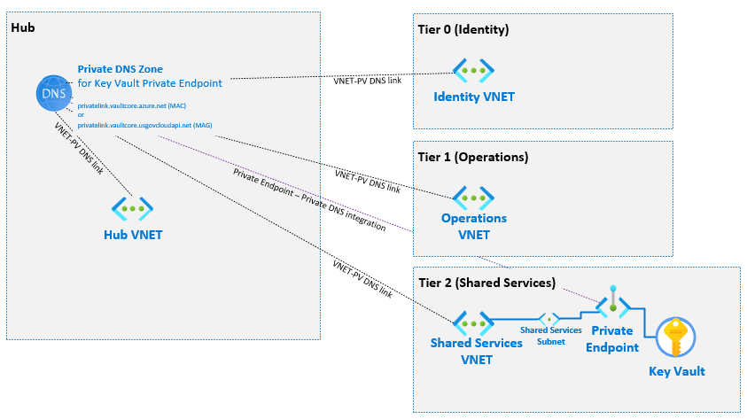

# Azure Key Vault Example

This example deploys a premium Azure Key Vault with Private Endpoint, Private DNS integration and RBAC permission model enabled. A premium key vault utilizes hardware security modules to protect key material.  Roles for use must be assigned post-deployment, review reference list below for detailed information.

Read on to understand what this example does, and when you're ready, collect all of the pre-requisites, then deploy the example.

## What this example does

### Deploys Azure Key Vault

The docs on Azure Key Vault: <https://docs.microsoft.com/en-us/azure/key-vault/>.  This sample shows how to deploy using Bicep and utilizes the shared file variable pattern to support the deployment.  By default, this template will deploy resources into standard default MLZ subscriptions and resource groups.  

The subscription and resource group can be changed by providing the resource group name (Param: targetResourceGroup) and ensuring that the Azure context is set the proper subscription.

### Architecture



As depicted in the diagram, this Infrastructure as Code deploys a Key Vault with the following configuration:

1. Premium SKU to enable HSM-backed keys.
2. RBAC Permission model.
2. Private endpoint to enable private connectivity.
3. Public access disabled.
4. Private link key vault private DNS zone in the HUB (for it to sit with the other private DNS zones).
5. All MLZ VNETs linked to the Key Vault Private DNS zone for proper resolution.

## Pre-requisites

1. A Mission LZ deployment (a deployment of mlz.bicep)
2. The outputs from a deployment of mlz.bicep (./src/bicep/examples/deploymentVariables.json).
3. The `PrivateEndpointNetworkPolicies` VNET Subnet property set to `Disabled` in clouds that do not yet have Private Link Support of NSG in GA. Use the PowerShell below to set this parameter prior to deployment:

```PowerShell
$vnetResourcegroup = "mlz-rg-sharedServices"
$vnetName = "mlz-vnet-sharedServices" 
$subnetName = "mlz-snet-sharedServices"
$vnet = Get-AzVirtualNetwork -ResourceGroupName $vnetResourcegroup -Name $vnetName
$subnet = Get-AzVirtualNetworkSubnetConfig -VirtualNetwork $vnet -Name $subnetName
$subnet.PrivateEndpointNetworkPolicies = "Disabled"
$vnet | Set-AzVirtualNetwork
```

See below for information on how to create the appropriate deployment variables file for use with this template.

### Template Parameters

Template Parameters Name | Description
-----------------------| -----------
keyVaultName | The name of key vault.  If not specified, the name will default to the MLZ default naming pattern.  
targetResourceGroup | The name of the resource group where the key vault will be deployed.   If not specified, the resource group name will default to the shared services MLZ resource group name and subscription.
targetVirtualNetworkSubnetResourceId | The resource id of the VNET Subnet to attach the Key Vault Private Endpoint to.

### Generate MLZ Variable File (deploymentVariables.json)

For instructions on generating 'deploymentVariables.json' using both Azure PowerShell and Azure CLI, please see the [README at the root of the examples folder](../README.md).

Place the resulting 'deploymentVariables.json' file within the ./src/bicep/examples folder.

### Deploying Azure Key Vault

Connect to the appropriate Azure Environment and set appropriate context, see getting started with Azure PowerShell for help if needed.  The commands below assume you are deploying in Azure Commercial and show the entire process from deploying MLZ and then adding a key vault post-deployment.

```PowerShell
cd .\src\bicep
Connect-AzAccount
New-AzSubscriptionDeployment -Name contoso -TemplateFile .\mlz.bicep -resourcePrefix 'contoso' -Location 'eastus'
cd .\examples
(Get-AzSubscriptionDeployment -Name contoso).outputs | ConvertTo-Json | Out-File -FilePath .\deploymentVariables.json
cd .\keyVault
New-AzSubscriptionDeployment -DeploymentName deployAzureKeyVault -TemplateFile .\key-vault.bicep -Location 'eastus'
```

```Azure CLI
az login
cd src/bicep
az deployment sub create -n contoso -f mlz.bicep -l eastus --parameters resourcePrefix=contoso
cd examples
az deployment sub show -n contoso --query properties.outputs > ./deploymentVariables.json
cd keyVault
az deployment sub create -n deployAzureKeyVault -f key-vault.bicep -l eastus
```

### References

* [Azure Key Vault Documentation](https://docs.microsoft.com/en-us/azure/key-vault/)
* [Azure Key Vault Overview](https://docs.microsoft.com/en-us/azure/key-vault/general/overview)
* [Provide access to Key Vault via RBAC](https://docs.microsoft.com/en-us/azure/key-vault/general/rbac-guide?tabs=azure-cli)
