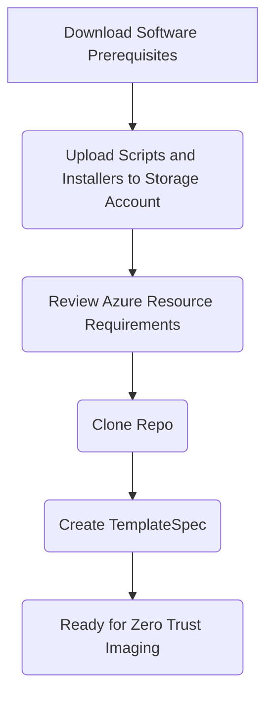
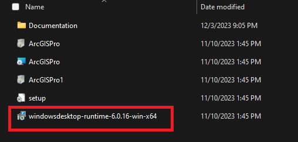
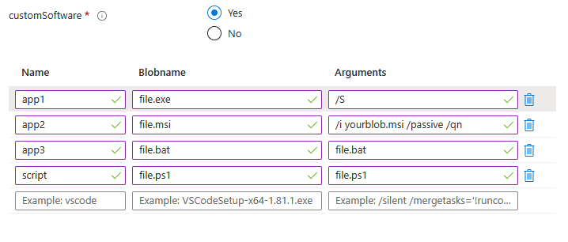

# Zero Trust and Azure Imaging

This zero trust imaging solution for Azure allows you create images in an Azure environment that adheres to zero trust. While other options exist in Azure, its either a manual process or it doesn't adhere to zero trust. Azure Image Builder (AIB) is a great imaging service in Azure but does not adhere to zero trust. The service creates a staging resource group with a storage account that cannot be configured with a private endpoint.  This breaks the zero trust principles. This solution uses a storage account with a private endpoint to store applications and the existing, preconfigured resources that comply with the principles.



## Prequisites

### Azure Resource Provider Feature for Encryption At Host

This solution adheres to Zero Trust which dictates that all virtual machine disks must be encrypted. The encryption at host feature enables disk encryption on virtual machine temp and cache disks. To use this feature, a resource provider feature must enabled on your Azure subscription. Use the following PowerShell script to enable the feature:

```powershell
Register-AzProviderFeature -FeatureName "EncryptionAtHost" -ProviderNamespace "Microsoft.Compute"
```

### Required Permissions

Permissions:
    Ensure the principal deploying the solution has "Owner" and "Key Vault Administrator" roles assigned on the target Azure subscription. This solution deploys role assignments at various scopes so the principal deploying this solution will need to be an Owner at the subscription scope for a successful deployment. It also deploys a key and secrets in a key vault to enhance security. A custom role may be used to reduce the scope of permisions required if your organization wants to use something other than they built in roles.

[Creating a custom role](https://learn.microsoft.com/en-us/azure/role-based-access-control/custom-roles)

### Software

Ensure the following software is installed on your client workstation:

* [Azure Bicep](https://learn.microsoft.com/en-us/azure/azure-resource-manager/bicep/overview?tabs=bicep)
* [Azure PowerShell Modules](https://learn.microsoft.com/en-us/powershell/azure/install-azure-powershell?view=azps-10.2.0)

### Upload the following scripts and files to your storage account container

* [Az.Accounts 2.12.1 PowerShell Module](https://www.powershellgallery.com/api/v2/package/Az.Accounts/2.12.1)
* [Az.Automation 1.9.0 PowerShell Module](https://www.powershellgallery.com/api/v2/package/Az.Automation/1.9.0)
* [Az.Compute 5.7.0 PowerShell Module](https://www.powershellgallery.com/api/v2/package/Az.Compute/5.7.0)
* [Az.Resources 6.6.0 PowerShell Module](https://www.powershellgallery.com/api/v2/package/Az.Resources/6.6.0)
* [Office Installer](https://www.microsoft.com/en-us/download/details.aspx?id=49117)
* [vDot Installers](https://github.com/The-Virtual-Desktop-Team/Virtual-Desktop-Optimization-Tool/archive/refs/heads/main.zip)
* [Teams Installer - Commercial](https://teams.microsoft.com/downloads/desktopurl?env=production&plat=windows&arch=x64&managedInstaller=true&download=true)
* [Teams Installer - DoD](https://dod.teams.microsoft.us/downloads/desktopurl?env=production&plat=windows&arch=x64&managedInstaller=true&download=true)
* [Teams Installer - GCC](https://teams.microsoft.com/downloads/desktopurl?env=production&plat=windows&arch=x64&managedInstaller=true&ring=general_gcc&download=true)
* [Teams Installer - GCCH](https://gov.teams.microsoft.us/downloads/desktopurl?env=production&plat=windows&arch=x64&managedInstaller=true&download=true)
* [Microsoft Visual C++ Redistributable](https://aka.ms/vs/16/release/vc_redist.x64.exe)
* [Remote Desktop WebRTC Redirector Service](https://aka.ms/msrdcwebrtcsvc/msi)
* [ArcGIS Pro Installer - as Zip File](https://pro.arcgis.com/en/pro-app/latest/get-started/download-arcgis-pro.htm)

    You can download ArcGIS Pro from My Esri or your ArcGIS Online organization.
    Once the application is downloaded, if your windows OS image requires ArcGIS Pro you will need to create a ZIP file that contains all of the installation bits including the Windows Runtime.

    Example:
    

    | Software | Minimum requirement
    |:---------|:--------:|
    |  Microsoft .NET  |  [Microsoft .NET Desktop Runtime 6.0.5](https://dotnet.microsoft.com/en-us/download/dotnet/thank-you/runtime-desktop-6.0.5-windows-x64-installer) or a [later patch](https://dotnet.microsoft.com/en-us/download/dotnet/6.0) release (6.0.6 and so on), using a Windows x64 installer, is required. The presence of Microsoft .NET Desktop Runtime 7 or later is inconsequential.|

### Example Custom Installers



### Existing Azure Resources

The following resources must exist in your Azure environment before deployment:

* Virtual Network
* Storage Account
  * Private Endpoint
  * Private DNS Zone
  * Blob container with executables, scripts, etc. that are required for the imaging deployment

### Disk Encryption Set Requirements

You must enable the feature for your subscription before you use the EncryptionAtHost property for your VM/VMSS. Use the following steps to enable the feature for your subscription.

Execute the following command to register the feature for your subscription

```powershell
Register-AzProviderFeature -FeatureName "EncryptionAtHost" -ProviderNamespace "Microsoft.Compute"

Get-AzProviderFeature -FeatureName "EncryptionAtHost" -ProviderNamespace "Microsoft.Compute"
```

* [Use the Azure PowerShell module to enable end-to-end encryption using encryption at host](https://learn.microsoft.com/en-us/azure/virtual-machines/windows/disks-enable-host-based-encryption-powershell)

### Deploy from the Azure Portal
<!-- markdownlint-disable MD013 -->
1. Deploy Zero Trust Imaging into `AzureCloud` or `AzureUsGovernment` from the Azure Portal:

    | Azure Commercial | Azure Government |
    | :--- | :--- |
    [](https://portal.azure.com/#blade/Microsoft_Azure_CreateUIDef/CustomDeploymentBlade/uri/https%3A%2F%2Fraw.githubusercontent.com%2FAzure%2Fmissionlz%2Fmain%2Fsrc%2Fbicep%2Fadd-ons%2FImaging%2Fsolution.json/uiFormDefinitionUri/https%3A%2F%2Fraw.githubusercontent.com%2FAzure%2Fmissionlz%2Fmain%2Fsrc%2Fbicep%2Fadd-ons%2FImaging%2FuiDefinition.json) | [](https://portal.azure.us/#blade/Microsoft_Azure_CreateUIDef/CustomDeploymentBlade/uri/https%3A%2F%2Fraw.githubusercontent.com%2FAzure%2Fmissionlz%2Fmain%2Fsrc%2Fbicep%2Fadd-ons%2FImaging%2Fsolution.json/uiFormDefinitionUri/https%3A%2F%2Fraw.githubusercontent.com%2FAzure%2Fmissionlz%2Fmain%2Fsrc%2Fbicep%2Fadd-ons%2FImaging%2FuiDefinition.json) |
<!-- markdownlint-enable MD013 -->

## Creating Template Spec for AirGapped Clouds

### Example

```powershell
New-AzTemplateSpec `
    -Name 'ZeroTrustImaging' `
    -ResourceGroupName rg-image-usgovvirginia-01 `
    -Version '1.0' `
    -Location usgovvirginia `
    -DisplayName "Zero Trust Image Template" `
    -TemplateFile '.\solution.json' `
    -UIFormDefinitionFile '.\uiDefinition.json'  `
    -Force
```

### Parameters

#### -AdminUsername

Specifies the local administrator user name of the virtual machine that will be captured.

```yaml
Type: String
```

#### -ContainerName

Specifies the container name where files, and scripts will be uploaded.

```yaml
Type: String
```

#### -GalleryName

Specifies the existing Azure Image Gallery where the image will be created.

```yaml
Type: String
```

#### -ImageName

Specifies the name of the image that will created.

```yaml
Type: String
```

#### -ImageOffer

Specifies the name of the image offer of the image that will be created.

```yaml
Type: String
```

#### -ImagePublisher

Specifies the name of the image publisher of the image that will be created.

```yaml
Type: String
```

#### -ImageSku

Specifies the name of the image SKU of the image that will be created.

```yaml
Type: String
```

#### -ImageVersion

Specifies the name of the image version of the image that will be created.

```yaml
Type: String
```

#### -InstallAccess

Specifies if Access will be installed on the image created.

```yaml
Type: Boolean
```

#### -InstallExcel

Specifies if Excel will be installed on the image created.

```yaml
Type: Boolean
```

#### -InstallFsLogix

Specifies if FsLogix will be installed on the image created.

```yaml
Type: Boolean
```

#### -InstallOneDrive

Specifies if OneDrive For Business will be installed on the image created.

```yaml
Type: Boolean
```

#### -InstallOneNote

Specifies if OneNote will be installed on the image created.

```yaml
Type: Boolean
```

#### -InstallPowerPoint

Specifies if PowerPoint will be installed on the image created.

```yaml
Type: Boolean
```

#### -InstallPublisher

Specifies if Publisher will be installed on the image created.

```yaml
Type: Boolean
```

#### -InstallTeams

Specifies if Teams will be installed on the image created.

```yaml
Type: Boolean
```

#### -InstallVirtualDesktopOptimizationTool

Specifies if Virtual Desktop Optimization Tool (VDOT) will be installed on the image created.

```yaml
Type: Boolean
```

#### -InstallVisio

Specifies if Visio will be installed on the image created.

```yaml
Type: Boolean
```

#### -InstallWord

Specifies if Word will be installed on the image created.

```yaml
Type: Boolean
```

#### -Location

Specifies a location for the resources of the solution to be deployed.

```yaml
Type: String
```

#### -MiName

Specifies the name of an existing managed identity to be used during deployment of the solution.

```yaml
Type: String
```

#### -OSVersion

Specifies the OS Version of the image to be captured.

```yaml
Type: String
```

#### -ResourceGroupName

Specifies the name of the resource group to create resources.

```yaml
Type: String
```

#### -SecurityType

Specifies the security type of the image to be captured.

```yaml
Type: String
```

#### -StorageAccountName

Specifies the name of the storage account where assets will be downloaded from and used during the image process.

```yaml
Type: String
```

#### -StorageEndpoint

Specifies the storage endpoint of the target storage account.

```yaml
Type: String
```

#### -SubnetName

Specifies the subnet of the virtual network to be used during the image process.

```yaml
Type: String
```

#### -TenantType

Specifies the tenant type used in the target environment.

```yaml
Type: String
AllowedValues: 'Commercial', 'DepartmentOfDefense','GovernmentCommunityCloud','GovernmentCommunityCloudHigh'
```

#### -UserAssignedIdentityObjectId

Specifies the object ID of the managed identity used during deployment.

```yaml
Type: String
```

#### -VirtualNetworkName

Specifies the virtual network name of the vNet used during the image process.

```yaml
Type: String
```

#### -VmName

Specifies the name of the virtual machine to be captuired.

```yaml
Type: String
```

#### -VmSize

Specifies the  size of the the virtual machine to be captuired.

```yaml
Type: String
```

### Adding Applications

* Add additional applications by adding addtional blocks of installers in module image.bicep
* Any blob called will have to be uploaded to the storage account and container that are defined in the parameter set
* Using the enabled argument will allow the installer to be modular and flexible during image creation

```bicep
var installers = [
    {
        name: 'myapp1'
        blobName: 'software1.exe'
        arguments: '/S'
        enabled: true
    }
    {
        name: 'myapp2'
        blobName: 'software2.exe'
        arguments: '/S'
        enabled: false
    }
]
```

### View Run Command Status

The applications are installed using the Run Command extension on the Azure virtual machine.  To the view and troubleshoot the status of a Run Command use the example below:

``` powershell
PS C:\git\ztaimage> $x = Get-AzVMRunCommand -ResourceGroupName rg-image -VMName vm-image -RunCommandName office -Expand InstanceView
PS C:\git\ztaimage> $x.InstanceView


ExecutionState   : Running
ExecutionMessage :
ExitCode         : 0
Output           :
Error            :
StartTime        : 8/2/2023 2:14:27 PM
EndTime          :
Statuses         :
```
