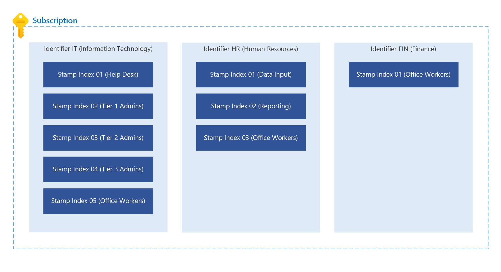
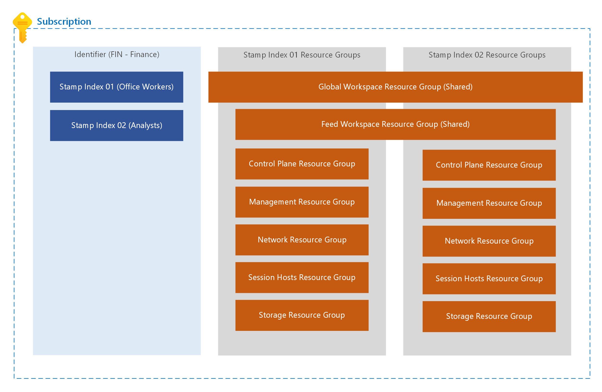

# Azure Virtual Desktop Solution

[**Home**](../README.md) | [**Features**](./features.md) | [**Design**](./design.md) | [**Prerequisites**](./prerequisites.md) | [**Troubleshooting**](./troubleshooting.md)

## Design

This Azure Virtual Desktop (AVD) solution will deploy a fully operational AVD [stamp](https://learn.microsoft.com/azure/architecture/patterns/deployment-stamp) in an Azure subscription. The "StampIndex" parameter in this solution allows each stamp to be identified and scale to the capacity of a single subscription. Either several small stamps or one large stamp could be deployed in one subscription.

To uniquely name multiple, unrelated stamps within a subscription, input a unique value for the "Identifier" parameter in each deployment.  To name multiple related stamps, use the same value for the "Identifier" but increment the "StampIndex" across your subscriptions.



Every AVD deployment within the same subscription will share the AVD global workspace. When the same "Identifier" is used but the "StampIndex" is incremented across the same subscription, the feed workspace is deployed only once per "Identifier". This simplifies the organization of AVD resources within the client. The "Identfier" is meant to represent a business unit or project within an organization.



The code is idempotent, allowing you to scale storage and sessions hosts, but the core management resources will persist and update for any subsequent deployments. Some of those resources are the host pool, application group, and log analytics workspace.

Both a personal or pooled host pool can be deployed with this solution. Either option will deploy a desktop application group with a role assignment. Selecting a pooled host pool will deploy the required resources and configurations to fully enable FSLogix. This solution also automates many of the [features](./features.md) that are usually enabled manually after deploying an AVD host pool.

With this solution you can scale up to Azure's subscription limitations. This solution has been updated to allow sharding. A shard provides additional capacity to an AVD stamp. See the details below for increasing storage capacity.

## Sharding to Increase Storage Capacity

To add storage capacity to an AVD stamp, the "StorageIndex" and "StorageCount" parameters should be modified to your desired capacity. The last two digits in the name for the chosen storage solution will be incremented between each deployment.

The "VHDLocations" setting will include all the file shares. The "SecurityPrincipalIds" and "SecurityPrincipalNames" will have an RBAC assignment and NTFS permissions set on one storage shard per stamp. Each user in the stamp should only have access to one file share. When the user accesses a session host, their profile will load from their respective file share.

## Firewall rules to improve security

The deployment has a set of firewall rules that use the **firewallRulesCollectionGroups** parameter to pass in firewall rule collection group configurations.   The default value for this variable creates two collection groups per AVD stamp deployed.   Additionally, the rules are conditional upon the identity selection, Entra ID or Active Directory based.

The rule set can be overridden, but should include the default set regardless.
Please review [Command Line Tools](../../../../../docs/deployment-guides/command-line-tools.md) for the basics of constructing a parameter file and command line usage for deployment.

```bicep

param customFirewallRuleCollectionGroups array = []

var defaultFirewallRuleCollectionGroups = [
  {
    name: 'AVD-CollapsedCollectionGroup-Stamp-${stampIndex}'
    properties: {
      priority: 200
      ruleCollections: [
        {
          name: 'ApplicationRules'
          priority: 150
          ruleCollectionType: 'FirewallPolicyFilterRuleCollection'
          action: {
            type: 'Allow'
          }
          rules: concat(
            [
              {
                name: 'AVD-RequiredDeploymentEndpoints'
                ruleType: 'ApplicationRule'
                protocols: [
                  {
                    protocolType: 'Https'
                    port: 443
                  }
                ]
                fqdnTags: []
                webCategories: []
                targetFqdns:avdFwDeploymentTargetFqdns
                targetUrls: []
                terminateTLS: false
                sourceAddresses: virtualNetworkAddressPrefixes
                destinationAddresses: []
                sourceIpGroups: []
              }
            ],
            contains(activeDirectorySolution, 'MicrosoftEntraId') ? [
              {
                name: 'AVD-EntraAuthEndpoints'
                ruleType: 'ApplicationRule'
                protocols: [
                  {
                    protocolType: 'Https'
                    port: 443
                  }
                ]
                fqdnTags: []
                webCategories: []
                targetFqdns: avdFwEntraIdAuthTargetFqdns
                targetUrls: []
                terminateTLS: false
                sourceAddresses: virtualNetworkAddressPrefixes
                destinationAddresses: []
                sourceIpGroups: []
              }
            ] : [],
            enableWindowsUpdateFwRules ? [
              {
                name: 'WindowsUpdateEndpoints'
                ruleType: 'ApplicationRule'
                protocols: [
                  {
                    protocolType: 'Https'
                    port: 443
                  }
                  {
                    protocolType: 'Http'
                    port: 80
                  }
                ]
                fqdnTags: [
                  'WindowsUpdate'
                ]
                webCategories: []
                targetFqdns: []
                targetUrls: []
                terminateTLS: false
                sourceAddresses: virtualNetworkAddressPrefixes
                destinationAddresses: []
                sourceIpGroups: []
              }
            ] : []
          )
        }
        {
          name: 'NetworkRules'
          priority: 140
          ruleCollectionType: 'FirewallPolicyFilterRuleCollection'
          action: {
            type: 'Allow'
          }
          rules: concat(
            [
              {
                name: 'KMS-Endpoint'
                ruleType: 'NetworkRule'
                ipProtocols: [
                  'Tcp'
                ]
                sourceAddresses: virtualNetworkAddressPrefixes
                destinationAddresses: []
                destinationFqdns: avdKmsDestinationFqdns
                destinationPorts: [
                  '1688'
                ]
                sourceIpGroups: []
                destinationIpGroups: []
              }
            ],
            [
              {
                name: 'AllowMonitorToLAW'
                ruleType: 'NetworkRule'
                ipProtocols: ['Tcp']
                sourceAddresses: virtualNetworkAddressPrefixes
                destinationAddresses: [cidrHost(operationsVirtualNetworkAddressPrefix, 3)] // Network of the Log Analytics Workspace, could be narrowed using parameters file post deployment
                destinationPorts: ['443'] // HTTPS port for Azure Monitor
                sourceIpGroups: []
                destinationIpGroups: []
                destinationFqdns: []
              }
            ],
            [
              {
                name: 'TimeSync'
                ruleType: 'NetworkRule'
                ipProtocols: [
                  'Udp'
                ]
                sourceAddresses: virtualNetworkAddressPrefixes
                destinationAddresses: []
                destinationFqdns: [
                  'time.windows.com'
                ]
                destinationPorts: [
                  '123'
                ]
                sourceIpGroups: []
                destinationIpGroups: []
              }
            ],
            [
              {
                name: 'AzureCloudforLogin'
                ruleType: 'NetworkRule'
                ipProtocols: [
                  'Tcp'
                ]
                sourceAddresses: virtualNetworkAddressPrefixes
                destinationAddresses: ['AzureActiveDirectory']
                destinationFqdns: []
                destinationPorts: [
                  '443'
                ]
                sourceIpGroups: []
                destinationIpGroups: []
              }
            ],
            contains(activeDirectorySolution, 'DomainServices') ? [
              {
                name: 'ADCommunicationRule'
                ruleType: 'NetworkRule'
                ipProtocols: [
                  'Tcp'
                  'Udp'
                ]
                sourceAddresses: virtualNetworkAddressPrefixes
                destinationAddresses: [
                  identityVirtualNetworkAddressPrefix
                ]
                destinationPorts: [
                  '53'
                  '88'
                  '389'
                  '445'
                  '139'
                  '135'
                  '89'
                  '123'
                  '1024-65535'
                ]
                sourceIpGroups: []
                destinationIpGroups: []
              }
            ] : []
          )
        }
      ]
    }
  }
]
var effectiveFirewallRuleCollectionGroups = empty(customFirewallRuleCollectionGroups) ? defaultFirewallRuleCollectionGroups : customFirewallRuleCollectionGroups


