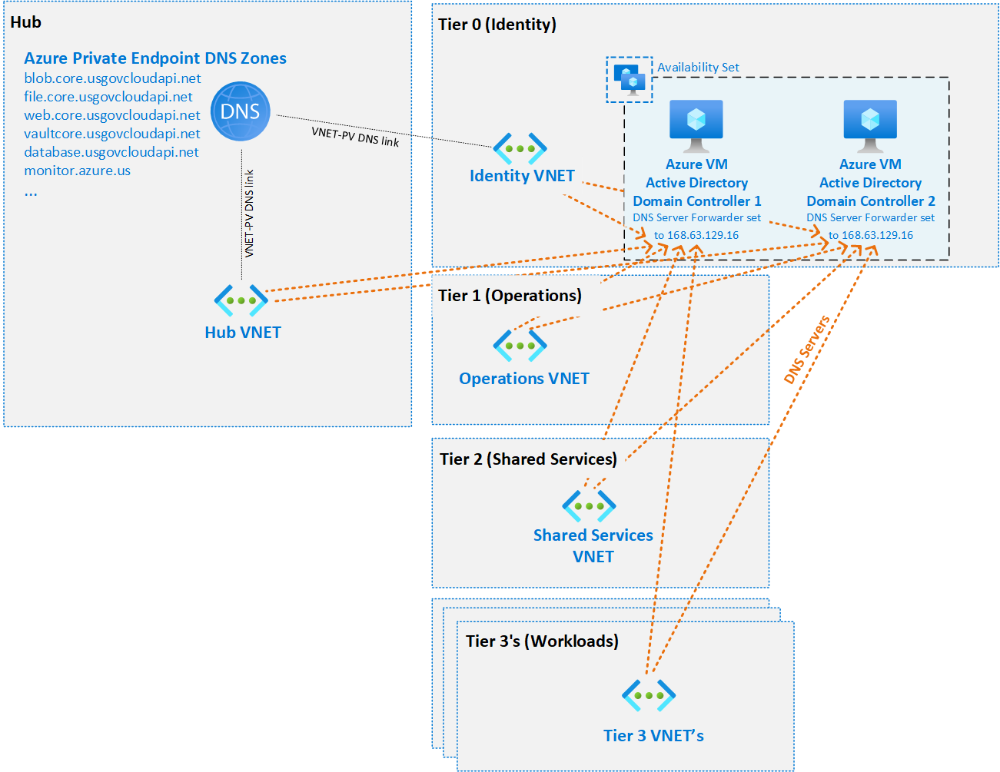

# Azure IaaS DNS Forwarders example

This example deploys Active Directory Domain Controller Virtual Machines in the MLZ identity tier. There is the option to add the domain controllers to an existing domain, or create a brand new forest.

## What this example does

### Builds Virtual Machines and configures them as Active Directory Domain Controllers

1. Deploys 2 Virtual Machines in an Availability Set
    - a Data Disk gets configured without caching to host the AD databases, as per [best practices](https://learn.microsoft.com/en-us/azure/architecture/reference-architectures/identity/adds-extend-domain#vm-recommendations)

2. Runs a DSC configuration to:
    - Install AD DS roles and features.
    - Promote the server to Domain Controller of a new or existing domain.
    - Configure the DNS Server forwarders.

## Pre-requisites

1. A Mission LZ deployment (a deployment of mlz.bicep)
2. The outputs from a deployment of mlz.bicep (./src/bicep/examples/deploymentVariables.json).  
3. A proper DNS resolution flow. See [DNS Resolution](README.md#dns-resolution)

### Generate MLZ Variable File (deploymentVariables.json)

For instructions on generating 'deploymentVariables.json' using both Azure PowerShell and Azure CLI, please see the [README at the root of the examples folder](../README.md).

Place the resulting 'deploymentVariables.json' file within the ./src/bicep/examples folder.

## Deployment

### Template Parameters

Template Parameters Name       | Description
---                            | ---
vmNamePrefix                   | 3 to 12 characters VM name prefix. -01 and -02 will get appended to that prefix.
nicPrivateIPAddresses          | array of two static IP addresses available in the Identity VNET subnet.
extensionsFilesContainerUri    | uri to the storage account used to host the DSC configuration and custom script file (if not relying on the public repo)           
extensionsFilesContainerSas    | storage account account SAS token used to host the DSC configuration and custom script file (if not relying on the public repo)  
dnsForwarders                  | default DNS server forwarders (for instance: DISA's). Defaults to Azure DNS.
createOrAdd                    | Whether to create a new forest or add both domain controllers to an existing domain.
dnsDomainName                  | Active Directory DNS Domain name.
netbiosDomainName              | Active Directory NETBIOS Domain name.
managementSubnets              | Managements subnets allowed in the Windows Firewall.
domainAdminUsername            | Domain Administrator username.
domainAdminPassword            | Domain Administrator password.
safemodeAdminUsername          | Safe mode username.
safemodeAdminPassword          | Safe mode password.
domainJoinUsername             | Domain join username (gets created to join other servers to the domain with minimal privileges).
domainJoinUserPassword         | Domain join password.

### Deploying IaaS DNS Forwarders

Connect to the appropriate Azure Environment and set appropriate context, see getting started with Azure PowerShell for help if needed.  The commands below assume you are deploying in Azure Government and show the entire process from deploying MLZ and then adding Domain Controllers post-deployment.

```PowerShell
cd .\src\bicep
Connect-AzAccount -Environment AzureUSGovernment
New-AzSubscriptionDeployment -Name contoso -TemplateFile .\mlz.bicep -resourcePrefix 'contoso' -Location 'USGovVirginia'
cd .\examples
(Get-AzSubscriptionDeployment -Name contoso).outputs | ConvertTo-Json | Out-File -FilePath .\deploymentVariables.json
cd .\iaas-activedirectory-domaincontrollers
$vmDomainAdminPassword = Read-Host -Prompt "Please provide a password for the domain administrator account, with a length of at least 12 characters" -AsSecureString
$vmDomainJoinPassword = Read-Host -Prompt "Please provide a password for the domain join account, with a length of at least 12 characters" -AsSecureString
New-AzResourceGroupDeployment -DeploymentName adDomainControllers `
                              -TemplateFile .\forwarderVm.bicep `
                              -ResourceGroupName 'contoso-rg-identity-mlz' `
                              -vmNamePrefix 'contoso-adds' `
                              -nicPrivateIPAddresses "10.9.1.4", "10.9.1.5" `
                              -dnsForwarders "168.63.129.16" `
                              -dnsDomainName "ad.contoso.com" `
                              -netbiosDomainName "CONTOSO" `
                              -managementSubnets "10.9.0.0/24" `
                              -domainAdminUsername "superuser1" `
                              -domainAdminPassword $vmDomainAdminPassword`
                              -safemodeAdminUsername "safemodeuser1" `
                              -safemodeAdminPassword $vmDomainAdminPassword `
                              -domainJoinUsername "domainjoinuser1" `
                              -domainJoinUserPassword $vmDomainJoinPassword            
```

### DNS Resolution

The MLZ deployment needs to be configured for private DNS resolution, one of two ways depending on your scenario.

### 1. DNS Forwarders in the Hub

Use the [IaaS DNS forwarders example](../iaas-dns-forwarders) to create DNS forwarders in the MLZ HUB, that will forward client DNS requests to Azure, Active Directory and the Internet as needed.

### 2. AD Domain Controllers act as DNS servers



In this scenario all of the Virtual Networks use the Domain Controllers as DNS servers. Prior to deploying this example, the Identity Virtual Network needs to be configured with the following DNS servers:

- Identity VNET DNS Server 1: Domain Controller VM 1 IP Address
- Identity VNET DNS Server 2: Domain Controller VM 2 IP Address
- Identity VNET DNS Server 3: 168.63.129.16

The Domain Controller VM's need proper DNS resolution during deployment, to access the DSC configuration. The above DNS configuration will allow the 1st DC to resolve, using the 3rd DNS server. The 2nd DC will be able to resolve the Active Directory domain using the 1st DNS server.
