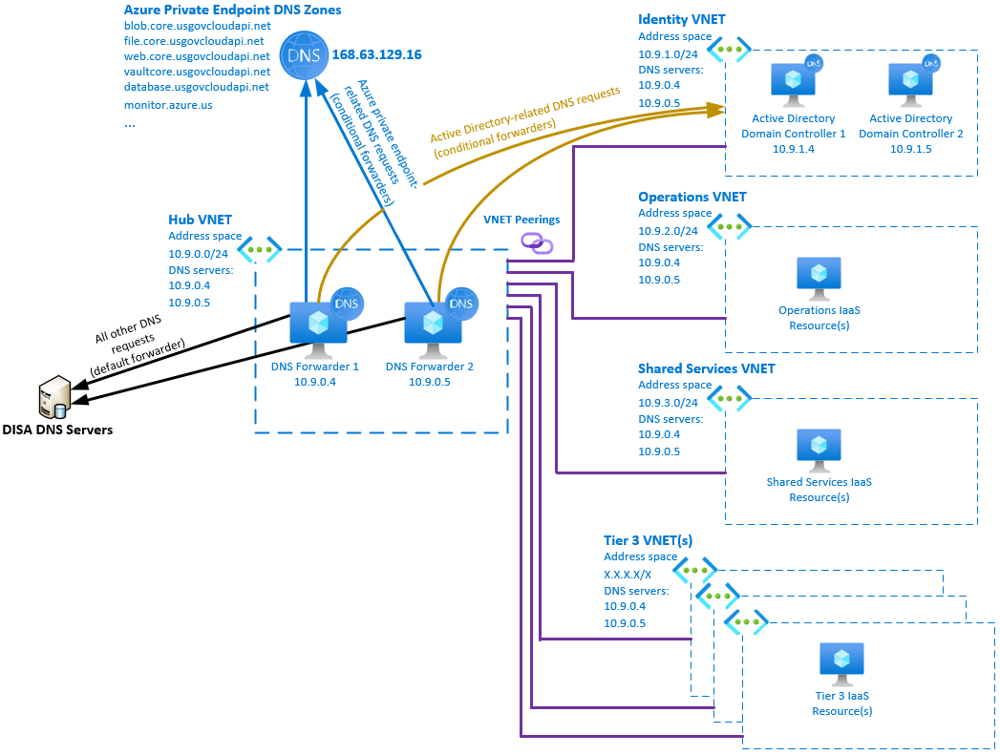

# Azure IaaS DNS Forwarders example

This example deploys DNS Forwarder Virtual Machines in the MLZ HUB, to enables proper resolution of Private Endpoint and internal domains accross all Virtual Networks.

## What this example does

### Follows best-practices

This Infrastructure as Code deploys the components to follow best practices: [Private Link and DNS integration in hub and spoke network architectures](https://docs.microsoft.com/en-us/azure/cloud-adoption-framework/ready/azure-best-practices/private-link-and-dns-integration-at-scale#private-link-and-dns-integration-in-hub-and-spoke-network-architectures)

### Configures proper DNS resolution in DoD Azure environments

The two Windows DNS Servers are configured to act as DNS servers for all Virtual Networks, and then forward DNS requests three different ways, as depicted below.



1. Azure Private Endpoint-related DNS requests get forwarded to the Azure DNS server (168.63.129.16), which uses the Private DNS zones configured as part of MLZ.
2. Active Directory-related DNS requests get forwarded to the Domain Controllers in the Identity tier.
3. All other DNS requests (Internet...) get forwarded to the default server forwarder, typically DISA DNS servers.

## Pre-requisites

1. A Mission LZ deployment (a deployment of mlz.bicep)
2. The outputs from a deployment of mlz.bicep (./src/bicep/examples/deploymentVariables.json).  

### Generate MLZ Variable File (deploymentVariables.json)

For instructions on generating 'deploymentVariables.json' using both Azure PowerShell and Azure CLI, please see the [README at the root of the examples folder](..\README.md).

Place the resulting 'deploymentVariables.json' file within the ./src/bicep/examples folder.

## Deployment

### Template Parameters

Template Parameters Name       | Description
---                            | ---
vmNamePrefix                   | 3 to 12 characters VM name prefix. -01 and -02 will get appended to that prefix.
vmAdminPassword                | local administrator password.
nicPrivateIPAddresses          | array of two static IP addresses available in the HUB VNET subnet.
extensionsFilesContainerUri    | uri to the storage account used to host the DSC configuration and custom script file (if not relying on the public repo)           
extensionsFilesContainerSas    | storage account account SAS token used to host the DSC configuration and custom script file (if not relying on the public repo)  
dnsServerForwardersIpAddresses | default DNS server forwarders (for instance: DISA's). Defaults to Azure DNS.
conditionalDnsServerForwarders | array of conditional forwarders to create, including Azure Private DNS zones and Active Directory-related zones. Defaults to Azure US Government's private endpoint DNS zones.

### Deploying IaaS DNS Forwarders

Connect to the appropriate Azure Environment and set appropriate context, see getting started with Azure PowerShell for help if needed.  The commands below assume you are deploying in Azure Government and show the entire process from deploying MLZ and then adding DNS forwarders post-deployment.

```PowerShell
cd .\src\bicep
Connect-AzAccount -Environment AzureUSGovernment
New-AzSubscriptionDeployment -Name contoso -TemplateFile .\mlz.bicep -resourcePrefix 'contoso' -Location 'USGovVirginia'
cd .\examples
(Get-AzSubscriptionDeployment -Name contoso).outputs | ConvertTo-Json | Out-File -FilePath .\deploymentVariables.json
cd .\keyVault
$vmAdminPassword = Read-Host -Prompt "Please provide a password for the VMs local administrator account, with a length of at least 12 characters" -AsSecureString
New-AzResourceGroupDeployment -DeploymentName IaaSDNSForwarders `
                              -TemplateFile .\forwarderVm.bicep
                              -ResourceGroupName 'contoso-rg-hub-mlz'
                              -vmNamePrefix 'contoso-dnsfwd'
                              -vmAdminPassword $vmAdminPassword
                              -nicPrivateIPAddresses "10.9.0.4", "10.9.0.5"
                              -dnsServerForwardersIpAddresses "2.2.2.2"                 
```

### conditionalDnsServerForwarders parameter

The `conditionalDnsServerForwarders` parameter defaults to the [Azure US Government Private Endpoint DNS zones](https://docs.microsoft.com/en-us/azure/private-link/private-endpoint-dns#government) listed in the [forwarderVm.bicep template](forwarderVm.bicep).

If you are using another cloud, wish to use a subsets of the [Private Endpoint DNS zones](https://docs.microsoft.com/en-us/azure/private-link/private-endpoint-dns) and/or add conditional forwarders for your own internal ActiveDirectory DNS domains, you will need to provide this parameter.

The example below specifies conditionalDnsServerForwarders for the Azure Storage Blob and Azure Key Vault services only, in the Azure Public Cloud, as well as a conditional DNS forwarder for an internal Active Directory zone (as depicted in the example diagram).

```PowerShell
$conditionalDnsServerForwarders = "[
{   
    'Name': 'privatelink.vaultcore.azure.net',
    'Forwarders': ['168.63.129.16']
},
{   
    'Name': 'privatelink.blob.core.windows.net',
    'Forwarders': ['168.63.129.16']
},
{   
    'Name': 'contoso.pri',
    'Forwarders': ['10.9.1.4','10.9.1.5']
}]" | ConvertFrom-JSON
New-AzResourceGroupDeployment -DeploymentName IaaSDNSForwarders `
                              -TemplateFile .\forwarderVm.bicep
                              -ResourceGroupName 'contoso-rg-hub-mlz'
                              -vmNamePrefix 'contoso-dnsfwd'
                              -vmAdminPassword $vmAdminPassword
                              -nicPrivateIPAddresses "10.9.0.4", "10.9.0.5"
                              -dnsServerForwardersIpAddresses "2.2.2.2" 
                              -conditionalDnsServerForwarders $conditionalDnsServerForwarders               
```

### How does it work

The [forwarderVm.bicep template](forwarderVm.bicep) goes through the following steps to deploy the solution:

1. Deploy Availability Set.
2. Deploy Network Interfaces.
3. Deploys Virtual Machines (using the [MLZ VM Module](https://github.com/FabienGilbert/mlz/blob/main/src/bicep/modules/windows-virtual-machine.bicep)).
4. Deploys the PowerShell DSC VM Extension, to install the Windows DNS Server feature and configure the default server forwarders (provided in the `dnsServerForwardersIpAddresses` parameter).
5. Deploy the Custom Script VM Extension, to create the Conditional DNS Forwarders (provided in the `conditionalDnsServerForwarders` parameter).

### Setting all Virtual Networks to use the Forwarders as DNS servers

Once the DNS Forwarders are deployed, you will want to set all of your Virtual Networks to use the forwarders as DNS servers. The PowerShell script below configures all of the existing Virtual Networks to use the DNS Forwarders as DNS servers.

```PowerShell
$dnsForwarders = "10.9.0.4", "10.9.0.5"
$virtualNetworks = Get-AzVirtualNetwork
foreach($vnet in $virtualnetworks){
    Write-Output ("Changing VNET " + [char]34 + $vnet.Name + [char]34 + " DNS Servers...")
    $vnet.DhcpOptions.DnsServers = $dnsForwarders
    $vnetSave = $vnet | Set-AzVirtualNetwork
}
```

