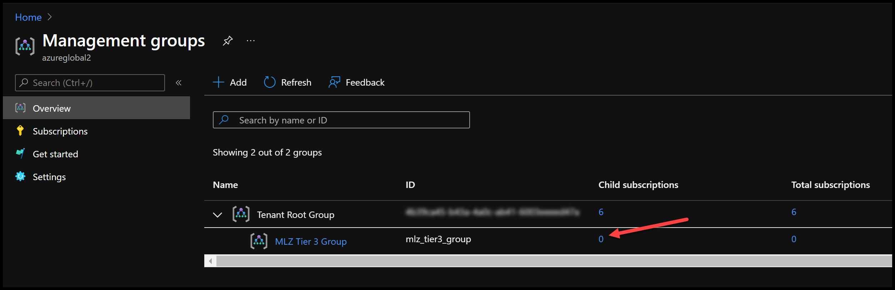
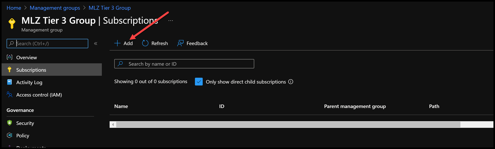
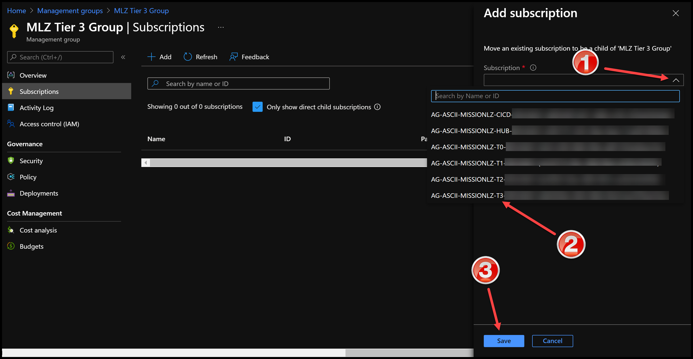
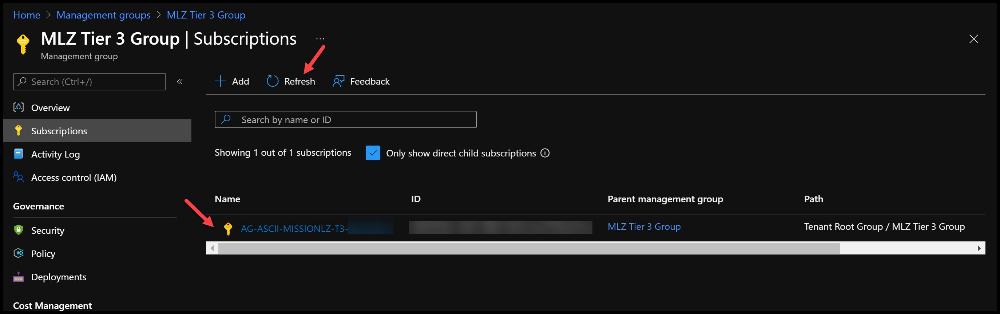

# Using Management Groups with Mission Landing Zone

## Concepts

### MLZ Structure

The base Mission Landing Zone (MLZ) tiers (SACA Hub, Tier 0, Tier1, Tier 2) can be deployed across one or more Azure subscriptions.  The  mission workloads (Tier 3) can be deployed into separate subscriptions per workload, consolidated into a single subscription, or a combination of these approaches can be used based on your needs.  So from a management perspective, there is usually one SACA Hub subscription, one Tier 0 subscription, one Tier 1 subscription, one Tier 2 subscription and one or more Tier 3 subscriptions.  

### Management Groups

You can manage the role-based access (RBAC) and policies for these subscriptions in a number of tools (portal, CLI, PS, etc.), but at the core, you can either manage them individually or as a group.  In an Enterprise setting, Microsoft recommends managing groups of subscriptions with Management Groups. Management Groups are "containers" of subscriptions that let you apply your governance conditions (RBAC, policies, and compliance) to a set of subscriptions as a single operation.

Management Groups can be created in a hierarchy where the policies, RBAC, and compliance settings of parent management groups are inherited by child management groups.  This provides a way to manage common governance settings at an appropriate level for each subscription.  

> For more information on Management Groups please see:  
[What are Azure Management Groups?](https://docs.microsoft.com/en-us/azure/governance/management-groups/overview)

## Recommendation

### Basics

If you are just kicking the tires on Mission Landing Zone, then there's no need to implement Management Groups.  If you have gone beyond the investigation phase and want to use MLZ in a production setting, then Management Groups are something that we recommend, especially if you have many Tier 3 workload subscriptions that all share similar governance characteristics.

If your MLZ management tiers (SACA Hub, Tier 0, Tier 1, and Tier 2) are all managed by the same group or share similar governance controls, then you can create a single management group for that set, otherwise a hierarchy of management groups may serve you better.  The Tier 3 (workload) subscriptions would probably have different management controls. If so, these subscriptions should be in a separate management group/hierarchy from the MLZ management tiers.

### Management group design

When setting up your management group hierarchy there are a number of critical design areas to consider.  The areas are documented in [Management group and subscription organization](https://docs.microsoft.com/en-us/azure/cloud-adoption-framework/ready/enterprise-scale/management-group-and-subscription-organization) in the Microsoft Cloud Adoption Framework documentation.

## Step-by-step

### Add a subscription to a management group

1. Create the Management Group

    - using the [Azure Portal](https://docs.microsoft.com/en-us/azure/governance/management-groups/create-management-group-portal)
    - using the [Azure CLI](https://docs.microsoft.com/en-us/azure/governance/management-groups/create-management-group-azure-cli)
    - using [Azure PowerShell](https://docs.microsoft.com/en-us/azure/governance/management-groups/create-management-group-powershell)

1. Click on the zero in the `Child subscriptions` column for the new management group to open the Subscriptions list. In the example below, our new management group is named `MLZ Tier 3 Group`.  

    <!-- markdownlint-disable MD033 -->
    <!-- allow html for images so that they can be sized -->
    
    <!-- markdownlint-enable MD033 -->

1. In the _Subscriptions_ blade, click on the `+Add` button to begin the subscription selection process.

    <!-- markdownlint-disable MD033 -->
    <!-- allow html for images so that they can be sized -->
    
    <!-- markdownlint-enable MD033 -->

1. In the _Add subscription_ dialog, click the drop-down arrow (1) on the _Subscription_ field to see a list of available subscriptions. Select the subscription (2) you want to add to the management group. Click the `Save` button (3) to associate the selected subscription with the management group.

    <!-- markdownlint-disable MD033 -->
    <!-- allow html for images so that they can be sized -->
    
    <!-- markdownlint-enable MD033 -->  
  
    > __Note:__  
    It may take a while to complete the association of the subscription to the management group.  When you click `Ok`, any controls (RBAC, policies, etc.) configured in the management group will be applied to the subscription and any controls from the subscription's old management group need to be removed.

1. Once the subscription is added to the management group, you may need to click the `Refresh` button to show the subscription in the management group's list.
    <!-- markdownlint-disable MD033 -->
    <!-- allow html for images so that they can be sized -->
    
    <!-- markdownlint-enable MD033 -->

## See also

Azure Docs: [Manage your resources with management groups](https://docs.microsoft.com/en-us/azure/governance/management-groups/manage)  
Video: [Azure Management Groups Overview 1/10/2019](https://www.youtube.com/watch?v=jOprhCxnEAg)  
Video: Management groups in [Azure Governance #1 - Overview](https://youtu.be/NxcwCwc_wmM?t=238) at [Azure Academy](https://www.youtube.com/channel/UC-MXgaFhsYU8PkqgKBdnusQ)
Microsoft Docs: [Azure management groups documentation](https://docs.microsoft.com/en-us/azure/governance/management-groups/)  
