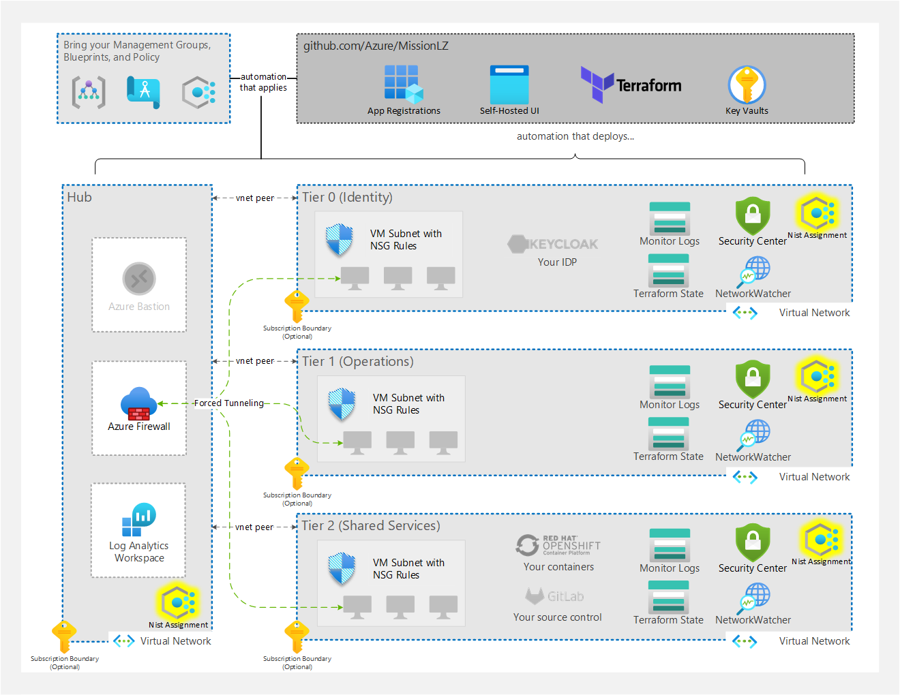

# Mission Landing Zone Regulatory Compliance - NIST Policies

As part of Mission Landing Zone (MLZ) it's been a goal to ensure deployments have the tools and resources available that allow it to be compliant with most regulations across industries. This does not mean that workloads are compliant, but it does mean that the technologies in use can be compliant. This is caused by not only the varying number of compliance bodies involved and and the regulations they mandate but also caused by the decisions required by how and what controls are followed.

For the purposes of this documentation we created an example method in which the MLZ deployment can be audited for current National Institute of Standards and Technology (NIST) controls and requirements using [Azure Policies built in initiative](https://docs.microsoft.com/en-us/azure/governance/policy/samples/nist-sp-800-53-r4) for NIST 800-53. _Note: this is focused on NIST controls that have built in policies in Azure clouds._

By adding the `--policy` switch to the deployment command the script will multiple assignments to the deployment final architecture. The result is for each Tier (Hub, Tier0, Tier1, and Tier2) there will be an additional policy/initiative assigned scoped to those recourse groups. This will not impact other policies/initiatives assigned that are deployed at different scopes either prior to deploying MLZ or post deployment.



## Known Issues

Currently there are a set of known issues with this approach. The first and somewhat important detail is that these policies are based on built in policies available in the different Azure environments. There are some variances currently between clouds. This will always happen when separate isolated environments have different deployment cycles but also can be based on preview testing versus generally available components in one cloud environment versus another.

A secondary issue comes from the method in which the assignment is deployed. This results in 'out of band' requirements for customers. In particular, the current built-in NIST initiative has a couple policies attached that modify and/or deploy if a resource doesn't exist. Example, VM extensions for guest policy configuration would be deployed if they don't exist in the VM. These types of policies require a managed identity be created that the Policy engine can use to take these actions. This managed identity must have contributor access to the resources but deploying as a contributor and not owner limits the ability. The terraform MLZ deployment as it is today using service principles with contributor rights cannot make this role assignment but the managed identity is created. This is by design for security purposes.

The final note is that these are audits based on NIST controls and recommendations that will require out of band work. As an example, storage account redundancy and encryption will require a decision process on what MLZ is using as temporary storage for logs versus requirements for the workloads. For example, encryption can be accomplished with multiple key models, which one is required for what category of data?

## Deploying

Deploying policy assignments for NIST along with a standard deployment of MLZ is as simple as adding the –policy switch to the deployment script command. This will add a separate assignment of the built in NIST initiative per resource group in the deployment, excluding the resource groups used as deployment artifacts like state and config.

Example:
 `src/scripts/deploy.sh -s <subscriptionID> -l usgovvirginia --tf-environment usgovernment –policy`

After the resources are deployed, you will need to go into go into each assignment and retrieve the managed identity and modify its role access to contributor scoped to the associated resource group. This is due to the initiative including modify and deploy policies that act on resources, like deploying the require policy guest configuration extensions to VMs.

Modifying

This model uses an additional custom terraform module called 'policy-assignments'. This can be modified for adding additional initiatives if desired. The module deployments retrieve their parameter values from a local json file stored in the module directory named 'nist-parameter-values' and named after the cloud environment they are deploying to, public or usgovernment.

Example parameters file snippet:
```
{
    "listOfMembersToExcludeFromWindowsVMAdministratorsGroup": 
    {
      "value": "admin"
    },
    "listOfMembersToIncludeInWindowsVMAdministratorsGroup": 
    {
      "value": "azureuser"
    },
    "logAnalyticsWorkspaceIdforVMReporting": 
    {
      "value": ${jsonencode(laws_instance_id)}
    },
    "IncludeArcMachines": 
    {
        "value": "true"
    }
```

In the above example the 'logAnalyticsWorkspaceIdforVMReporting' is retrieved from the running terraform deployment variables. This could be modified to use a central logging workspace if desired.

What's Next

While this is only a start, the NIST controls included in the built-in initiatives are a good start to understanding requirements on top of MLZ for compliance. In the near future the hopes are for this to be expanded with additional built-in initiatives as well as offering an option to create your own initiative and custom policies. Potential additions will be server baselines, IL compliances, and custom policies.

Also scripts to assist in these out-of-band processes will be added.